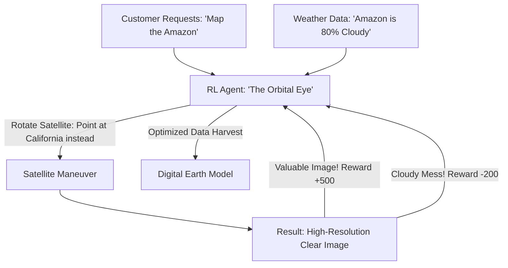

# RL for Satellite Image Targeting (Orbital Vision)

🧠 **What does this do? (The Analogy)**
Think of a **Person with a camera on a moving train who only has 10 shots left**. 
- They want to take pictures of the most beautiful sights (Cities, Forests, Harbors). 
- If they take a picture of a "Cloud," it is a wasted shot. 
- **RL for Satellite Image Targeting** is the AI that manages **Planet or Maxar satellites**. 
- It looks at weather forecasts and says: "London is cloudy today, don't point the camera there. Point it at New York instead." 
It manages the **Limited Battery and Memory** of the satellite to ensure that every single photo taken is worth thousands of dollars to customers.

🔍 **Step-by-Step Explanation:**
1. **Dynamic Tasking**: The AI receives 1,000 requests from different customers every hour.
2. **Cloud Prediction**: Using weather satellites to predict which parts of Earth will be visible.
3. **Maneuver Planning**: Deciding the best way to "Rotate" the satellite (using reaction wheels) to point the camera accurately.
4. **Benefit**: It maximizes **Profit**. By only taking pictures that are "Clear," the satellite company can sell 5x more data without launching more satellites.

📊 **High-Level Design (HLD)**

✅ **Why use this?**
It is the best choice for **Earth Observation (EO)**. As we move toward "Real-Time Earth Mapping," RL is the only way to coordinate a swarm of 100 satellites so they don't all take a picture of the same thing at the same time.

🌍 **Real-World Examples:**
1. **Planet Labs**: Managing a fleet of 200 "Doves" to take a picture of the entire Earth every single day using automated RL tasking.
2. **SpaceX Starshield**: Developing advanced AI-tasking for their government-focused satellite constellations.
3. **Google Earth**: Using AI to select the "best" satellite images from different sources to create a perfect, cloud-free map of the world.
