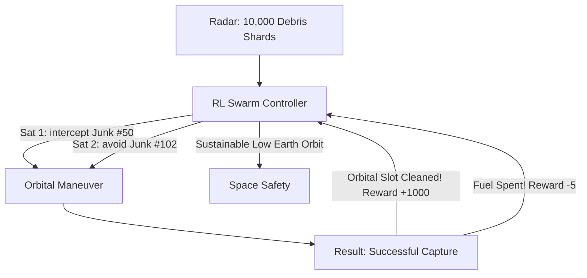

# RL for Satellite Swarm Debris Removal (Orbital Logic)

🧠 **What does this do? (The Analogy)**
Think of a **Swarm of 100 magnetic Bees cleaning up a swarm of 10,000 shards of glass floating in the air**. 
- The glass (Space Debris) is moving at 17,000 mph. 
- If a Bee hits a piece of glass the wrong way, it shatters and creates **more** debris (The Kessler Syndrome). 
- **RL for Satellite Swarms** is the AI that coordinates the "Bees" (CubeSats). 
- It treats the "Orbital Graveyard" as a cooperative game. The satellites "Talk" to each other to decide who catches which piece of junk, ensuring they use the **minimum fuel** and **zero risk** of collision. 
It is the only way to keep "Space" open for future generations.

🔍 **Step-by-Step Explanation:**
1. **Multi-Agent Coordination**: 100+ satellites work together without a central "Ground Control" (Decentralized RL).
2. **Orbital Mechanics**: The AI must solve the "Lambert's Problem" (how to get from Point A to Point B in space) 10,000 times a minute.
3. **Collision Avoidance**: A hard constraint. If any two objects touch, the reward becomes $-\infty$.
4. **Benefit**: It is the **Safest** way to handle debris. Human pilots can't track 10,000 objects at once, but RL can manage the entire swarm in real-time.

📊 **High-Level Design (HLD)**

✅ **Why use this?**
It is the gold standard for **Future Space Operations**. With 50,000 new satellites being launched this decade, space is becoming a "Traffic Jam." RL is the "Air Traffic Control" that keeps the sky from falling.

🌍 **Real-World Examples:**
1. **Astroscale**: A company building "Cleaner Satellites" that use AI to dock with and remove space junk.
2. **NASA Starling Mission**: Testing a swarm of CubeSats that can navigate and work together autonomously in orbit.
3. **Orbital Insight**: Using AI to predict the "Paths of Chaos" for space debris to help satellites maneuver safely.
