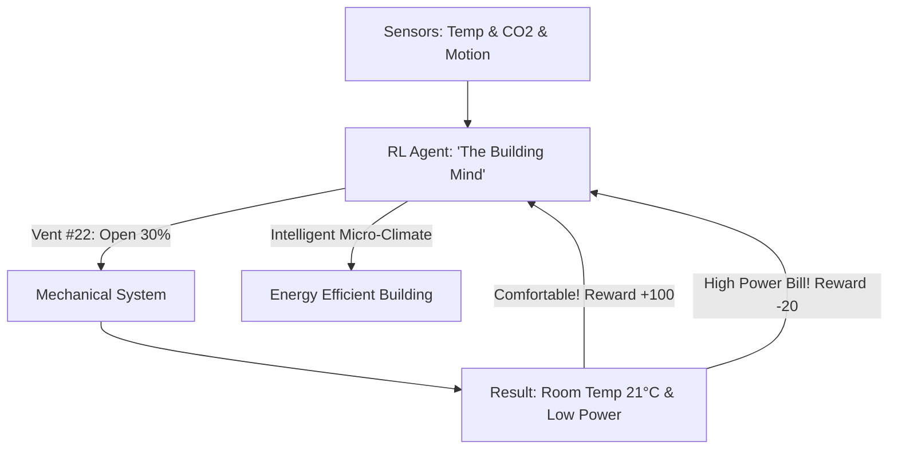

# RL for Smart Building HVAC (Climate Optimization)

🧠 **What does this do? (The Analogy)**
Think of a **Person trying to keep a 50-room hotel comfortable while the guests are constantly moving in and out**. 
- If they heat every room, they go bankrupt. 
- If they turn off the heat, the guests complain. 
- **RL for Smart Building HVAC** is the AI that manages the **Thermostat of a Skyscraper**. 
- It uses "Occupancy Sensors" to see where the people are. 
- It "Predicts" that a meeting will happen in Room 302 in 10 minutes, so it starts cooling that room **now**. 
It creates a "Micro-Climate" for every individual person while saving **20-40%** on the building's energy bill.

🔍 **Step-by-Step Explanation:**
1. **Dynamic Prediction**: The AI learns the building's "Thermal Inertia" (how fast it cools down).
2. **Occupancy Sensing**: Using Wi-Fi signals and Motion sensors to "see" where the people are without cameras.
3. **Multi-Zone Control**: Managing 100+ separate air vents simultaneously.
4. **Benefit**: It is much better than "Schedules." Standard HVAC runs from 9 AM to 5 PM regardless of whether anyone is there. RL HVAC only runs when and where it is needed.

📊 **High-Level Design (HLD)**

✅ **Why use this?**
It is the best choice for **Commercial Real Estate**. Buildings are responsible for nearly 40% of global carbon emissions. Using RL to make them smarter is one of the fastest ways to fight climate change while actually saving money for the building owner.

🌍 **Real-World Examples:**
1. **BrainBox AI**: A leading company that uses RL to connect to existing building controllers and reduce energy use in 24 hours.
2. **Siemens Desigo CC**: Integrating AI to manage large-scale campuses and hospitals.
3. **Edge Building (Amsterdam)**: The "smartest building in the world," which uses AI to optimize the environment for every employee based on their phone location.
