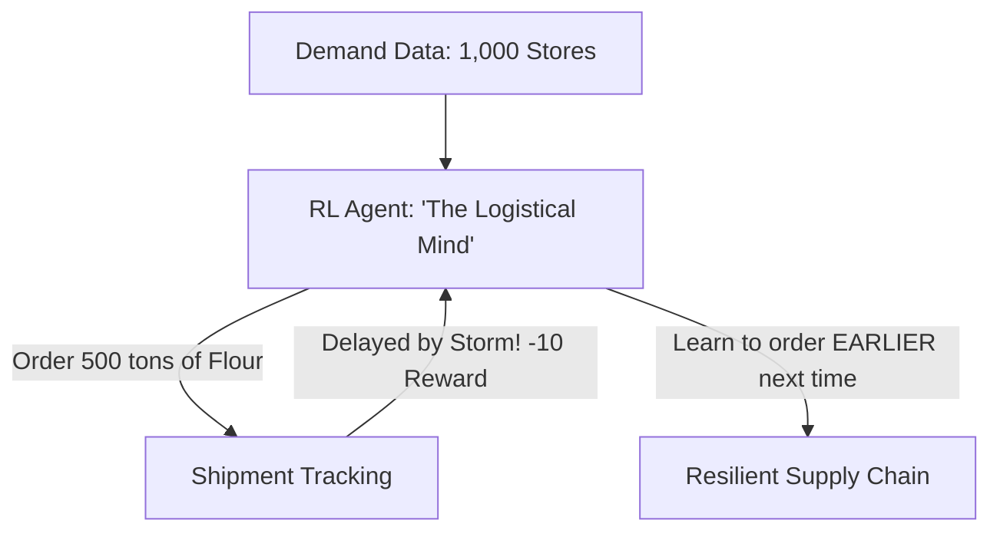

# RL for Supply Chain Risk (Hedging AI)

🧠 **What does this do? (The Analogy)**
Think of a **Grocery Store Manager preparing for a Snowstorm**. 
- If they order too much milk, it goes bad (Holding Cost). 
- If they order too little, the shelves are empty and customers are angry (Stockout Penalty). 
- **RL for Supply Chain** is an AI that "Plays a Game" where the pieces are **Trucks, Warehouses, and Ships**. 
- It has to decide exactly how much of 1,000 different products to order every day, accounting for the fact that a "Shipment might be late" or a "Storm might happen."

🔍 **Step-by-Step Explanation:**
1. **Inventory Management**: Deciding the "Reorder Point" for every item in every warehouse.
2. **Risk Hedging**: The AI is rewarded for having "Safety Stock"—extra items that are only used if a disaster happens.
3. **Multi-Echelon Optimization**: Coordinating the Factory, the Main Warehouse, and the 100 Local Stores simultaneously.
4. **Benefit**: It is much better at "Bullwhip Effect" prevention than human managers. It keeps the supply chain stable even when demand is jumping around.

📊 **High-Level Design (HLD)**

✅ **Why use this?**
It is the standard for **Modern Retail**. Companies like Amazon and Walmart use RL to manage millions of moving parts so that when you click "Buy," the product is already in a warehouse near you.

🌍 **Real-World Examples:**
1. **Semiconductor Logistics**: Managing the "2-year wait time" for computer chips by using RL to predict which types of chips will be needed in 2026.
2. **Emergency Response**: An AI that manages the supply chain of "Blood and Medicine" across 50 hospitals during a pandemic, ensuring nobody runs out of life-saving supplies.
