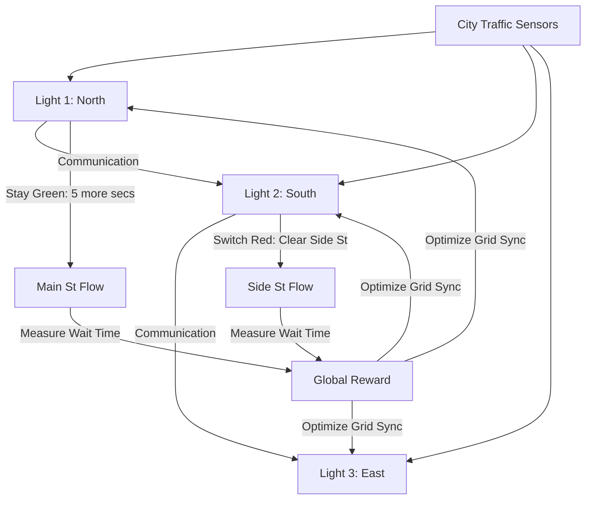

# RL for Traffic Signal Grid (Urban Flow)

🧠 **What does this do? (The Analogy)**
Think of a **Person managing 100 garden hoses to water a giant park**. 
- If they open one hose too much, another part of the park dries up. 
- **RL for Traffic Signal Grid** is an AI that manages the **Heartbeat of a City**. 
- It doesn't just look at one intersection; it looks at the **Whole Grid**. 
- If a "Green Wave" is created on Main Street, the AI makes sure it doesn't cause a "Gridlock" on Second Street. 
It uses **Multi-Agent RL** where every traffic light is a "Mini-Brain" that talks to its neighbors to keep the cars moving as smoothly as possible.

🔍 **Step-by-Step Explanation:**
1. **Observation**: Cameras and sensors at every light measure the length of the "Queue" (waiting cars).
2. **Action**: The AI decides whether to "Extend" the green light or switch to red.
3. **Cooperative Reward**: A light is rewarded not just for clearing its own traffic, but for the **average speed** of the whole city.
4. **Benefit**: It reduces commute times by **15-30%** and drastically reduces fuel consumption and pollution by stopping cars from idling.

📊 **High-Level Design (HLD)**

✅ **Why use this?**
It is the best choice for **Smart City Infrastructure**. If you want to solve urban congestion without spending $10 billion on new tunnels, RL-based signal optimization is the "Software Solution" that makes the existing city 20% more efficient.

🌍 **Real-World Examples:**
1. **Google Traffic Signal AI (Project Green Light)**: Used in cities like Rio de Janeiro and Seattle to reduce stops and emissions.
2. **KACST (Saudi Arabia)**: Using RL to manage the massive traffic surges during Hajj and other peak events.
3. **Alibaba City Brain**: A massive RL system that coordinates traffic, ambulances, and buses across Hangzhou, China.
