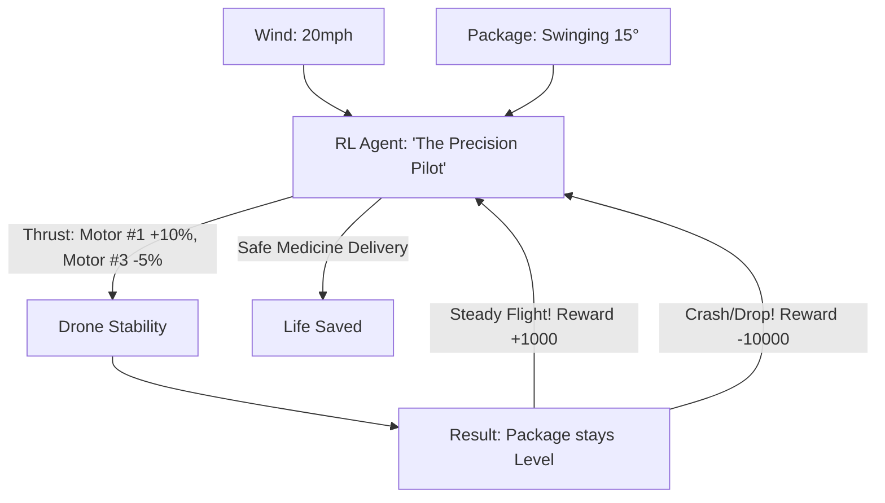

# RL for UAV Payload Delivery (Precision Flight)

🧠 **What does this do? (The Analogy)**
Think of a **Person trying to carry a full Bowl of Soup while running through a Windstorm**. 
- If they just run fast, the soup splashes out (Oscillation). 
- If they run too slow, they are late. 
- **RL for UAV Payload Delivery** is the AI that manages **Delivery Drones**. 
- It has to carry a heavy package hanging on a rope (A "Slung Load"). 
- As the package swings, it pulls the drone in different directions. 
- The AI learns to "Counter-Swing"—it moves the drone in a specific "Dance" to cancel out the movement of the package, keeping it perfectly steady even in high winds.

🔍 **Step-by-Step Explanation:**
1. **Dynamic Load**: The center of gravity of the drone is constantly moving.
2. **Swing Dampening**: The AI learns to perform "Anti-Swing" maneuvers (moving the drone slightly forward as the package swings back).
3. **The Reward**: Based on "Target Accuracy" and "Minimum Vibration."
4. **Benefit**: It allows drones to deliver **Sensitive Equipment** (like blood samples or medicine) to remote areas without the package being damaged by turbulence.

📊 **High-Level Design (HLD)**

✅ **Why use this?**
It is the best choice for **Last-Mile Logistics**. If you want a drone that can deliver a hot coffee or a fragile glass bottle without a single drop being spilled, RL is the only controller capable of handling the complex physics of a swinging load.

🌍 **Real-World Examples:**
1. **Zipline**: Using AI to deliver blood and vaccines across Rwanda and Ghana in all weather conditions.
2. **Amazon Prime Air**: Developing drones that can land safely in a backyard while carrying a swinging package.
3. **Military Transport**: Massive helicopters using RL to carry "Slung Loads" (like Humvees) through combat zones with zero human pilot error.
