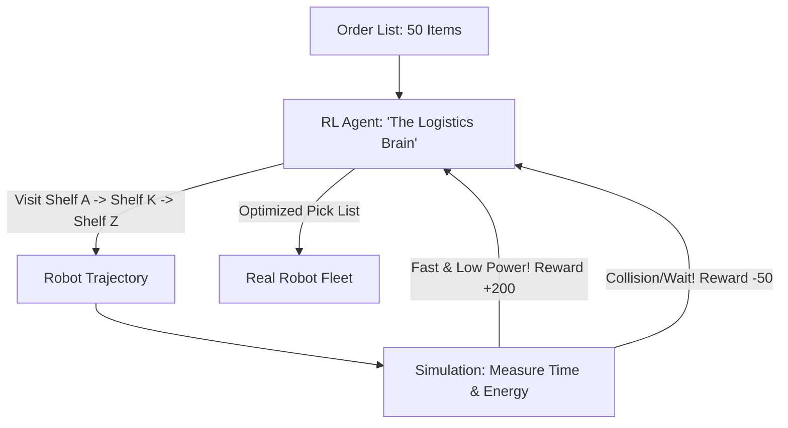

# RL for Warehouse Pick Path (Logistics Optimization)

🧠 **What does this do? (The Analogy)**
Think of a **Person in a Giant Supermarket with a shopping list of 50 items**. 
- If they just go to the items in the order of the list, they will walk back and forth for 2 hours (Inefficient). 
- **RL for Warehouse Pick Path** is the AI that manages the **Amazon Fulfillment Center**. 
- It looks at the 50 items and "Calculates" a single, smooth path that visits all 50 shelves in one loop. 
- It accounts for **Congestion** (other robots in the way) and **Battery Life**. 
It turns a 1-hour job into a **10-minute job**, allowing millions of packages to be shipped every day.

🔍 **Step-by-Step Explanation:**
1. **Dynamic TSP (Traveling Salesman Problem)**: Unlike a static map, the warehouse is full of moving parts (other robots and people).
2. **Path Encoding**: The AI uses a **Pointer Network** or **Transformer** to decide the sequence of shelf visits.
3. **Multi-Robot Coordination**: The AI ensures that 1,000 robots don't all try to go through the same "narrow aisle" at the same time.
4. **Benefit**: It maximizes **Throughput**. It allows a warehouse to handle 3x more orders without increasing the size of the building.

📊 **High-Level Design (HLD)**

✅ **Why use this?**
It is the best choice for **Automated E-commerce**. If you are building a modern fulfillment center, RL-based path planning is what separates the "market leaders" from the "slow competitors."

🌍 **Real-World Examples:**
1. **Amazon Robotics (Kiva Systems)**: Managing thousands of floor robots that bring shelves to human workers.
2. **Ocado Smart Platform**: The world's most advanced automated grocery warehouse, where 1,000 robots coordinate in a 3D grid.
3. **Alibaba Logistical Hubs**: Using RL to optimize the "last-mile" sorting before packages are sent to delivery trucks.
