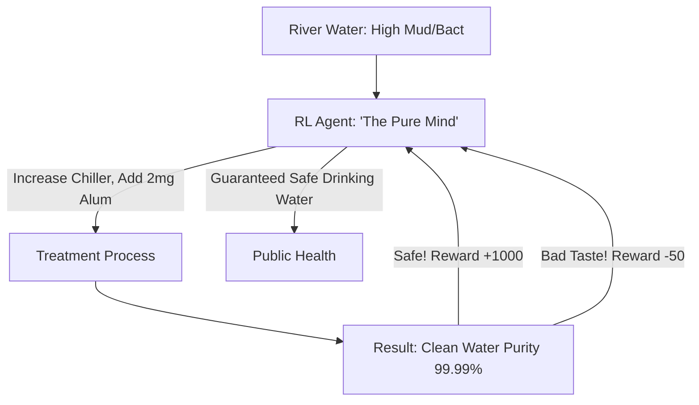

# RL for Water Treatment (Hydration Safety)

🧠 **What does this do? (The Analogy)**
Think of a **Person trying to mix the perfect glass of lemonade, but for 1 million people at once**. 
- The "Sugar and Lemons" are **Chlorine and Filters**. 
- If the water is too dirty (High Turbidity), people get sick. 
- If there's too much chlorine, the water tastes bad and is dangerous. 
- **RL for Water Treatment** is the AI that manages the **City's Water Works**. 
- It looks at the "Raw Water" coming from the river (which changes when it rains) and instantly adjusts the filters and chemicals to ensure the "Tap Water" is 100% safe. 
It uses **Safe RL** to ensure that it **never** experiments with public health, only optimizing within "Gold Standard" safety limits.

🔍 **Step-by-Step Explanation:**
1. **Inflow Monitoring**: Measuring the pH, bacteria levels, and sediment of incoming water.
2. **Dosing Control**: Deciding the exact milligram of chemical to add per liter.
3. **Safety Shielding**: A "Constraint" layer that prevents the AI from ever choosing a toxic level of chemicals.
4. **Benefit**: It is much more **Responsive** than human operators. It can react to a sudden "Chemical Spill" or "Flash Flood" in the river in seconds, whereas humans might take hours to notice the change in sensors.

📊 **High-Level Design (HLD)**

✅ **Why use this?**
It is the best choice for **Municipal Infrastructure**. As cities grow and pollution becomes more complex, RL ensures that we can maintain a "Standard of Life" by automating the most critical part of our survival—clean water.

🌍 **Real-World Examples:**
1. **Singapore PUB (Water Agency)**: Using AI and RL to manage their "NEWater" recycling system, turning wastewater back into drinking water.
2. **Suez Water**: Implementing RL-based "Energy Management" to reduce the cost of pumping water through giant city networks.
3. **Desalination Plants**: Using RL to manage the "Pressure" and "Membranes" of salt-to-fresh-water conversion to save electricity.
