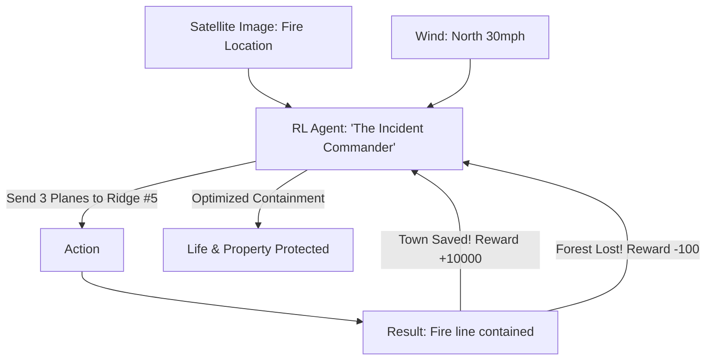

# RL for Wildfire Spread Control (Disaster AI)

🧠 **What does this do? (The Analogy)**
Think of a **Person playing a game of Chess against a Fire**. 
- The Fire (The Opponent) is aggressive, unpredictable, and fast. 
- The "Pieces" are **Water Planes, Bulldozers, and Firefighters**. 
- **RL for Wildfire Spread Control** is an AI that "Plays the Game" where the board is a **1,000-mile Forest**. 
- It looks at the wind and the dryness of the trees and "Predicts" where the fire will be in 12 hours. 
- It is rewarded for "Cutting it off" (creating a firebreak) before the fire even reaches that spot. 
It helps commanders make life-saving decisions in the middle of a chaotic disaster.

🔍 **Step-by-Step Explanation:**
1. **Dynamic Fire Model**: The AI uses a simulator to "Dream" about 1,000 different ways the fire could spread.
2. **Resource Allocation**: Deciding exactly where to send the limited number of helicopters.
3. **Multi-Agent Coordination**: Coordinating ground crews and air support so they don't get in each other's way.
4. **Benefit**: It is **Predictive**. Humans usually react to where the fire *is*. RL reacts to where the fire *will be*, saving homes and lives that would otherwise be lost.

📊 **High-Level Design (HLD)**

✅ **Why use this?**
It is the best choice for **Disaster Management**. As climate change makes wildfires larger and faster, human commanders need AI "Co-Pilots" that can process millions of data points every second to find the only path to safety.

🌍 **Real-World Examples:**
1. **FireLine (SOTA Research)**: Using deep RL to coordinate autonomous drones that drop fire retardant in front of a moving fire.
2. **NASA FireSense**: Using AI to detect and predict fire behavior from space, optimized by RL for planning response routes.
3. **CalFire**: Experimenting with AI-based "Resource Management" to deploy firefighters more effectively during peak fire season.
