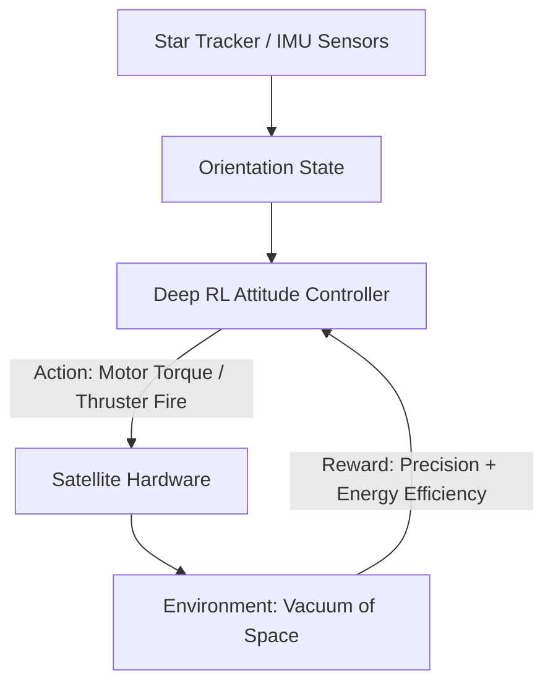

# Satellite Attitude Control RL

🧠 **What does this do? (The Analogy)**
Think of a **Telescope floating in a Dark Room**. You want to point it exactly at one tiny candle 10 miles away. But the telescope is spinning slowly, and you only have tiny "Puffs of Air" (Thrusters) to move it. **Satellite RL** is the "Astro-Navigator." it calculates the exact timing and force of every "Puff" to rotate the massive satellite into the perfect position to take a photo of a galaxy or a storm on Earth.

🔍 **Step-by-Step Explanation:**
1. **The State**: Current orientation (Quaternions), angular velocity (how fast it's spinning), and the target position.
2. **The Reward**: Minimizing **Pointing Error** and **Fuel/Energy Usage**.
3. **The Action**: Torque applied to reaction wheels or firing small gas thrusters.
4. **Conservation of Momentum**: In space, there is no air to stop you. If you start spinning, you spin forever unless you fire a thruster in the opposite direction. RL handles this complex "Zero-G Physics" perfectly.

📊 **High-Level Design (HLD)**

✅ **Why use this?**
Modern satellites need to "Hop" between targets very quickly. Standard math controllers are slow. RL can learn to "Pre-calculate" the spin so the satellite arrives at the target 2x faster, allowing it to collect much more scientific data.

🌍 **Real-World Examples:**
1. **SpaceX Starlink**: Automatically adjusting thousands of satellites to maintain their position and point their internet antennas at Earth.
2. **James Webb Telescope**: Precise pointing to keep a distant star exactly in the center of the camera for weeks at a time.
