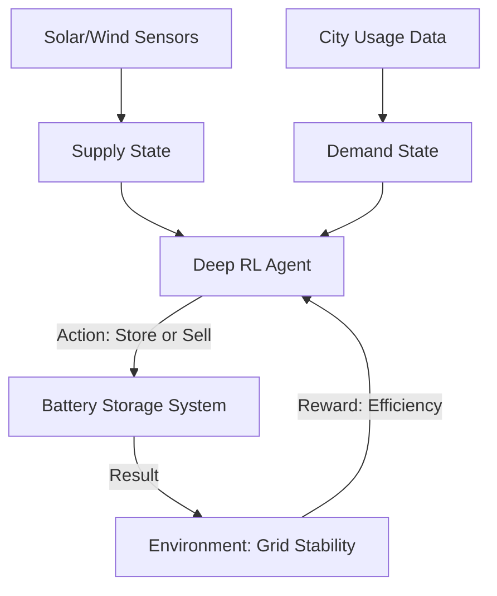

# Smart Grid Energy Balancing RL

🧠 **What does this do? (The Analogy)**
Think of a **Water Reservoir**. During a storm (high renewable supply), you want to fill the reservoir. During a drought (high consumer demand), you want to release the water. **Smart Grid RL** is the "Dam Manager." It predicts when the wind will blow and when people will turn on their air conditioners. It decides exactly when to charge massive batteries and when to sell that energy back to the city to prevent a blackout.

🔍 **Step-by-Step Explanation:**
1. **The State**: Solar/Wind output, current house-hold demand, and the price of electricity.
2. **The Reward**: Minimizing the **Cost** of electricity while maximizing the use of "Green" energy.
3. **The Action**: Charge batteries, Discharge batteries, or buy from the main grid.
4. **Complexity**: It must handle the "Intermittency" of renewables (e.g., a cloud covering the solar panels) in real-time.

📊 **High-Level Design (HLD)**

✅ **Why use this?**
It is the only way to reach **100% Renewable Energy**. Because the sun doesn't always shine, we need AI to manage the storage perfectly so the lights never go out.

🌍 **Real-World Examples:**
1. **Tesla Autobidder**: A software platform that uses RL to manage "Big Batteries" (Powerwalls) to maximize profit and grid stability.
2. **Microgrid Control**: Used in remote islands to balance diesel generators with solar power perfectly.
