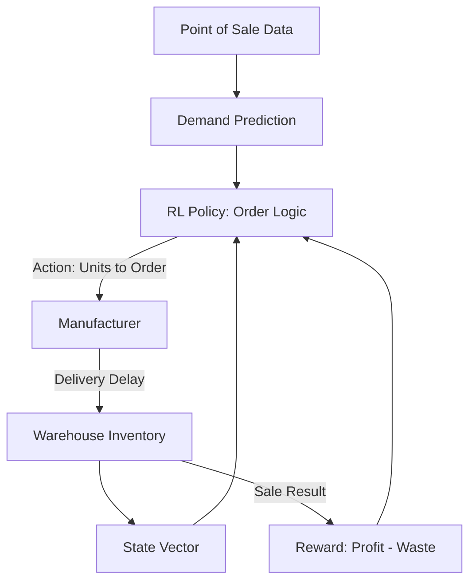

# Supply Chain Inventory RL

🧠 **What does this do? (The Analogy)**
Think of a **Grocery Store Manager**. If they buy too much milk, it spoils and they lose money. If they buy too little, they run out and customers get angry. **Supply Chain RL** is an "Expert Manager" that looks at every store in a whole country. It predicts that a heatwave is coming, so it orders 20% more ice cream for the stores in the South, while reducing orders for hot soup.

🔍 **Step-by-Step Explanation:**
1. **The State**: Current stock on shelves, products "on the way" (in-transit), and historical demand patterns.
2. **The Reward**: Minimizing **Holding Cost** (storing items) and **Stock-out Cost** (losing sales).
3. **The Action**: Exactly how many units to order from the factory today.
4. **Bullwhip Effect**: RL helps prevent the "Bullwhip Effect" where small changes in customer buying lead to massive, wasteful over-production at the factory.

📊 **High-Level Design (HLD)**

✅ **Why use this?**
It is the backbone of **Modern Retail**. Companies like Amazon and Walmart use this to ensure that products are available within 24 hours while keeping their warehouses as empty as possible to save money.

🌍 **Real-World Examples:**
1. **Amazon Logistics**: Deciding where to place items in 1,000 different warehouses so they are close to the people who are likely to buy them tomorrow.
2. **Pharmaceutical Distribution**: Ensuring life-saving medicines are available at every hospital while minimizing the waste of expired doses.
