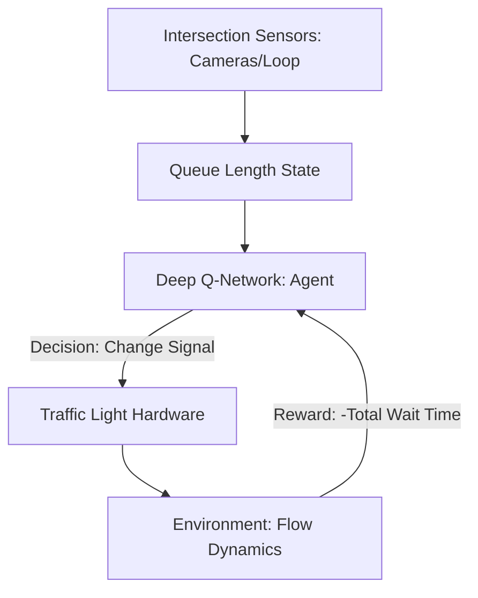

# Traffic Signal Control RL

🧠 **What does this do? (The Analogy)**
Think of a **City with 1,000 traffic lights**. Standard lights use a simple timer (e.g., "60 seconds green, 60 seconds red"). But what if there are 100 cars on the North road and 0 cars on the East road? The East cars shouldn't have to wait! **Traffic RL** acts like a **God-eye Controller** that sees the length of every queue in the city and changes the lights in real-time to "drain" the busiest roads first, reducing city-wide congestion by 20-30%.

🔍 **Step-by-Step Explanation:**
1. **The State**: Number of cars waiting at each lane (Pressure).
2. **The Reward**: Minimizing the **Total Waiting Time** of all cars in the district.
3. **The Action**: Switch to the next phase (e.g., turn North-South Green) or stay on the current phase.
4. **Coordination**: Multiple intersections share their "Queue Data" so that a green light at one intersection doesn't just create a "Traffic Wave" that crashes into a red light at the next one.

📊 **High-Level Design (HLD)**

✅ **Why use this?**
It is one of the most successful **Real-World RL Applications**. Companies like Google and Siemens use this to reduce CO2 emissions and fuel waste in major cities.

🌍 **Real-World Examples:**
1. **Google Traffic Signal AI**: In cities like Hamburg and Jakarta, Google's AI has reduced "Stop-and-Go" traffic by up to 30%.
2. **Emergency Vehicle Routing**: Automatically turning all lights "Green" for an ambulance while ensuring the rest of the city traffic doesn't collapse.
