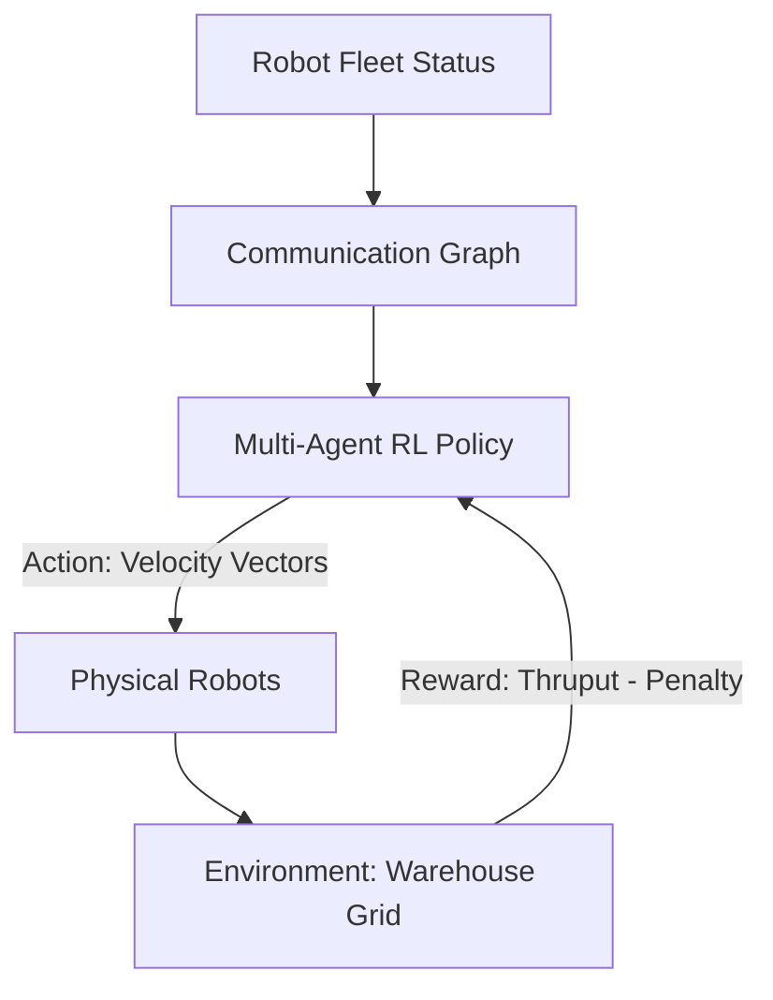

# Warehouse Robot Coordination RL

🧠 **What does this do? (The Analogy)**
Think of a **Busy Kitchen** with 50 chefs. If everyone just runs to the fridge at the same time, they will crash and drop the food. **Warehouse RL** is the "Invisible Choreographer." It manages a fleet of hundreds of robots (like the ones in Amazon warehouses) ensuring they move at full speed without ever touching each other. It finds the "Perfect Flow" where robots weave in and out like a synchronized dance.

🔍 **Step-by-Step Explanation:**
1. **The State**: X,Y coordinates of every robot, plus the locations of all shelves and obstacles.
2. **The Reward**: Delivering the maximum number of packages per hour while having **Zero Collisions**.
3. **The Action**: Speed and Direction for every robot at every millisecond.
4. **Decentralized Coordination**: Each robot has its own "Brain" but they all share a "Communication Layer" so they can "Signal" their intent to their neighbors (e.g., "I am turning left in 2 seconds").

📊 **High-Level Design (HLD)**

✅ **Why use this?**
It is the only way to scale **Automation**. A human can manage 2-3 robots. A simple algorithm can manage 10. But to manage 1,000 robots in one building, you need RL to handle the infinite possible ways they could block each other.

🌍 **Real-World Examples:**
1. **Amazon Kiva Robots**: Thousands of small orange robots that carry entire shelves of products to human pickers.
2. **Automated Parking Garages**: Robots that slide under cars and move them into tight spaces to maximize parking density.
