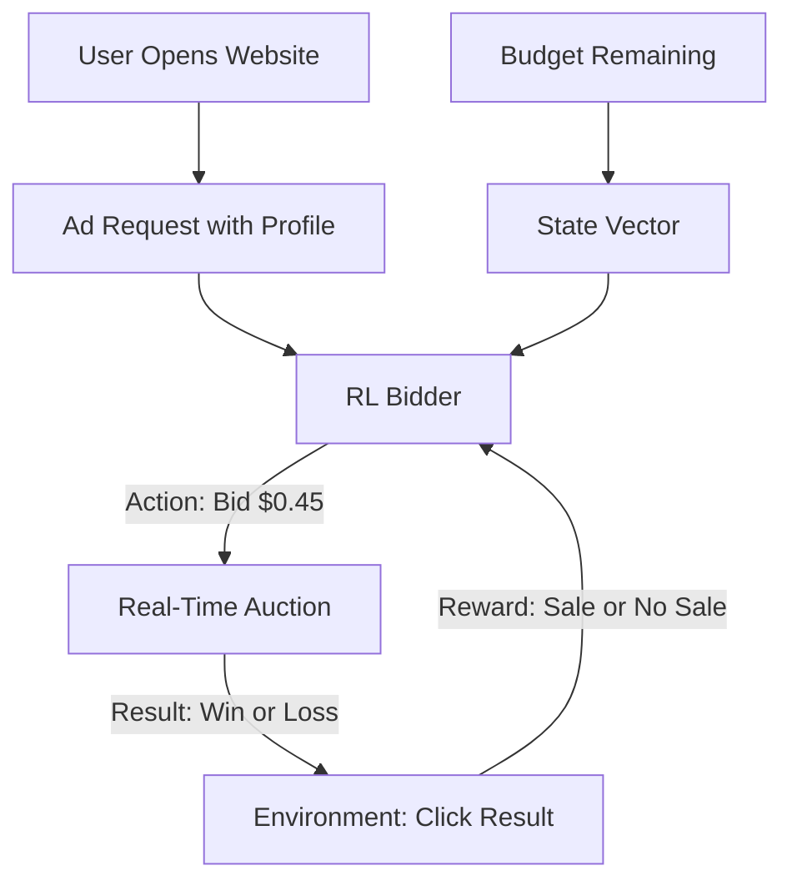

# Ad Placement Bidding RL

🧠 **What does this do? (The Analogy)**
Think of an **Auction for a Billboard**. Every time you open a website, there is a tiny, 10-millisecond auction happening behind the scenes to decide which ad you see. **Ad Bidding RL** is a "Super-Fast Auctioneer." It knows how much money you have left for the day and how likely you are to click on the ad. It decides exactly how many cents to bid so that you get the most customers for the least amount of money.

🔍 **Step-by-Step Explanation:**
1. **The State**: User profile, time of day, website content, and the remaining daily budget.
2. **The Reward**: The **ROI (Return on Investment)**—how many dollars in sales did we get for every dollar spent on ads?
3. **The Action**: The precise bid amount (in micro-dollars) for the current impression.
4. **Budget Management**: RL is better than humans here because it can "save" money during the quiet morning hours and spend it aggressively during the busy evening hours when people are more likely to buy.

📊 **High-Level Design (HLD)**

✅ **Why use this?**
It is the engine that powers **The Modern Internet**. Companies like Google, Facebook, and Amazon use RL to manage billions of these auctions every single day.

🌍 **Real-World Examples:**
1. **RTB (Real-Time Bidding)**: Managing high-frequency ad auctions across millions of websites.
2. **E-commerce Promoted Items**: Deciding which product to show you at the top of a search result to maximize the chance of you finding what you need.
