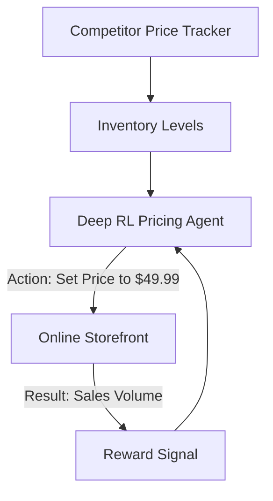

# Dynamic Pricing RL

🧠 **What does this do? (The Analogy)**
Think of a **Fruit Vendor in a Market**. If it's 10 AM and they have 100 apples, they sell them for $1. If it's 5 PM and they still have 80 apples, they drop the price to $0.50 so they don't go to waste. **Dynamic Pricing RL** is a "Super-Fast Vendor." It looks at millions of customers every second. It knows when a competitor lowers their price, or when a holiday is coming, and it adjusts the price of every item on a website to maximize total profit.

🔍 **Step-by-Step Explanation:**
1. **The State**: Competitor prices, remaining inventory, time of day, and how many people are currently looking at the product.
2. **The Reward**: Total **Revenue** or **Profit** over a 24-hour period.
3. **The Action**: Increase or Decrease the price by a specific percentage.
4. **Game Theory**: RL is essential here because if one AI lowers the price, the competitor's AI might lower it too (Price War). RL learns to find a stable "Nash Equilibrium" where everyone makes money.

📊 **High-Level Design (HLD)**

✅ **Why use this?**
It is the standard for **Airlines, Hotels, and E-commerce**. If you've ever seen a flight price change three times in one hour, you were probably watching an RL agent at work.

🌍 **Real-World Examples:**
1. **Uber Surge Pricing**: Increasing prices when demand is high to encourage more drivers to get on the road.
2. **Amazon Buy Box**: Automatically adjusting prices to win the "Buy Box" while maintaining a target profit margin.
