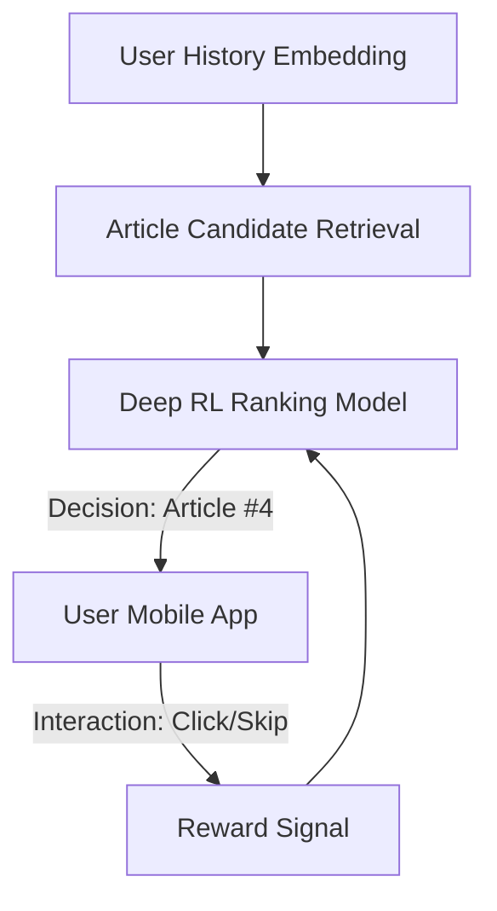

# News Recommendation System RL

🧠 **What does this do? (The Analogy)**
Think of a **Librarian who knows you perfectly**. Every time you walk in, they have a new book ready. But they don't just give you "The same book twice." If you read a mystery yesterday, they might give you a science book today to keep your life interesting. **News RL** balances your **Interests** (Click-Through Rate) with **New Topics** (Diversity/Exploration) to ensure you never get bored.

🔍 **Step-by-Step Explanation:**
1. **The State**: A mathematical summary of every article you've clicked on in the last 30 days.
2. **The Reward**: The positive signal when you click, and a "High Bonus" if you stay on the page and read the whole article (Engagement).
3. **The Action**: Which article to put at the top of your feed right now.
4. **Exploration**: Occasionally showing you a "Mystery" article you've never expressed interest in to see if you have a new hobby.

📊 **High-Level Design (HLD)**

✅ **Why use this?**
It is the engine behind **TikTok, YouTube, and Netflix**. These systems use RL to keep you "Hooked" by perfectly predicting what you want to see next before you even know it.

🌍 **Real-World Examples:**
1. **TikTok Feed**: Learning which 15-second videos you like and instantly adjusting the next video to maximize your "watch time."
2. **E-commerce Cross-selling**: Recommending a "Case" right after you buy a "Phone" because it knows that sequence has a high reward probability.
