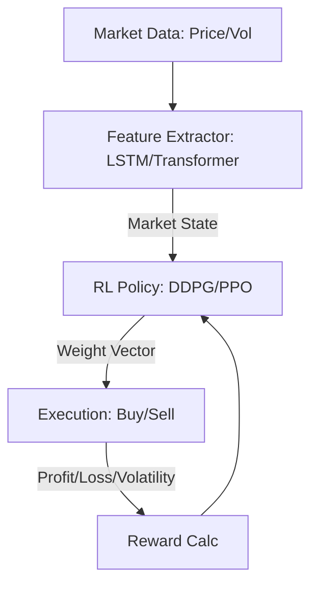

# Portfolio Optimization RL

🧠 **What does this do? (The Analogy)**
Think of a **Gardener managing a greenhouse**. Some plants (Stocks) grow fast but die easily; others grow slow but are steady. **RL Finance** is like a gardener who constantly moves water and fertilizer (Money) from the plants that are starting to wilt to the plants that are about to bloom. The goal is to have the **tallest, healthiest garden** (Highest Profit) with the **least amount of dead plants** (Lowest Risk).

🔍 **Step-by-Step Explanation:**
1. **State ($s_t$)**: The current prices, volumes, and technical indicators of a group of stocks.
2. **Action ($a_t$)**: A vector of weights (e.g., 50% Tech, 30% Gold, 20% Cash).
3. **Reward ($r_t$)**: The **Sharpe Ratio** (Profit divided by Volatility). We want high returns but with a "smooth" ride.
4. **Environment**: The stock market is highly stochastic (random), so the RL agent must learn to detect "signals" in the noise.
5. **Rebalancing**: The agent trades every day (or every minute) to keep the portfolio in the "Sweet Spot" of risk and return.

📊 **High-Level Design (HLD)**

✅ **Why use this?**
Standard finance models (like Markowitz) are static—they don't adapt well to sudden market crashes. RL is **Dynamic**. It can learn to "Get out of the market" when it sees a specific pattern of risk, saving millions of dollars for investors.

🌍 **Real-World Examples:**
1. **Crypto Trading Bots**: Managing a basket of 50 cryptocurrencies, automatically shifting funds into "Stablecoins" during a market dip.
2. **Pension Fund Management**: Long-term rebalancing of stocks and bonds to ensure that retired workers have a stable income regardless of market cycles.
