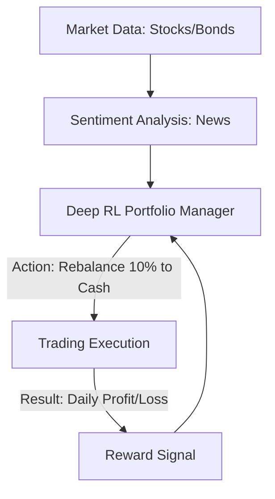

# Portfolio Risk Management RL

🧠 **What does this do? (The Analogy)**
Think of a **Gardener with limited water**. They have 10 types of plants. Some grow fast but die easily (High-risk stocks), some grow slow but are very tough (Bonds). If a storm is coming, the gardener moves the water to the tough plants. If it's sunny, they give more to the fast growers. **Portfolio RL** is a "Financial Gardener" that manages billions of dollars. It constantly "Moves the Money" to the safest and most profitable assets based on the "Market Weather."

🔍 **Step-by-Step Explanation:**
1. **The State**: Price history, news sentiment, interest rates, and current asset correlation.
2. **The Reward**: The **Sharpe Ratio** (Reward per unit of Risk). We want the most money for the least "Heart-attack" (Volatility).
3. **The Action**: Sell 5% of Stock A, Buy 5% of Bond B.
4. **Hedging**: The RL learns to find "Uncorrelated" assets. It knows that if Gold goes up, maybe Oil goes down, so it buys both to stay balanced.

📊 **High-Level Design (HLD)**

✅ **Why use this?**
It is the core of **Quantitative Hedge Funds**. Human traders get emotional and panic during a market crash. RL stays calm, looks at the math, and manages the risk perfectly even when everyone else is panicking.

🌍 **Real-World Examples:**
1. **BlackRock Aladdin**: One of the world's largest risk management systems, using advanced modeling to manage $20 trillion in assets.
2. **Robo-Advisors**: Using RL to automatically adjust your retirement savings based on how close you are to retiring and how the market is performing.
