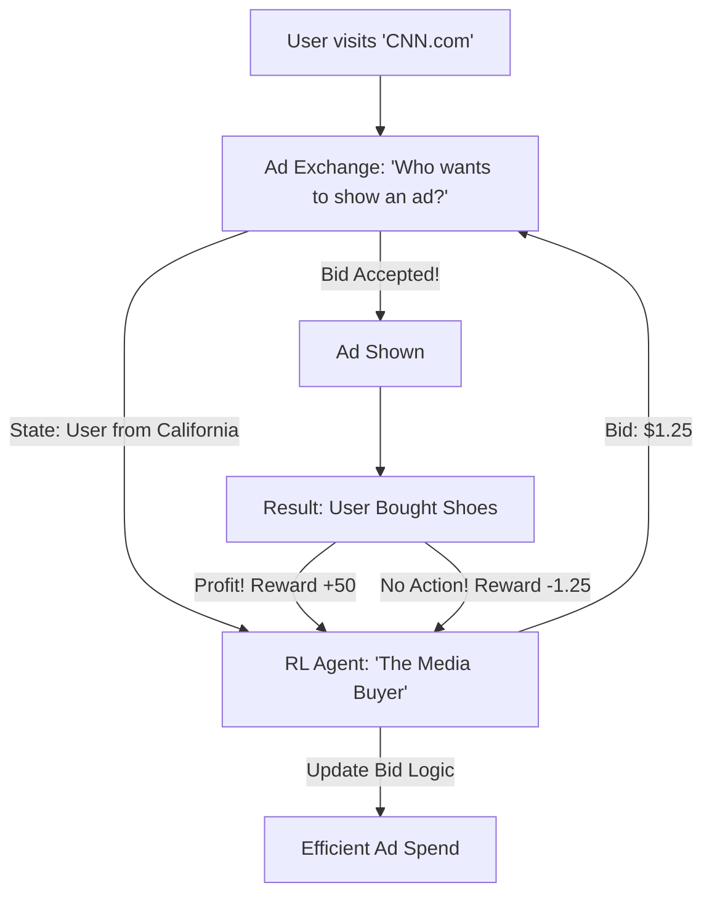

# RL for Ad Placement (Marketing AI)

🧠 **What does this do? (The Analogy)**
Think of a **Person at an Auction with $1,000 in their pocket**. 
- They want to buy a billboard in Times Square. 
- 1,000 other people also want that billboard. 
- **RL for Ad Placement** is the AI that decides how much to "Bid" for every single person who opens a website. 
- It asks: "Is this user likely to buy my product? If yes, I will pay $2.00 to show them an ad. If no, I will only pay $0.01." 
It manages **Real-Time Bidding (RTB)**, completing millions of auctions every second to ensure the company makes more money than it spends on advertising.

🔍 **Step-by-Step Explanation:**
1. **User Profiling**: The AI looks at "Contextual Signals" (what device are they on? what time is it?).
2. **Probability of Conversion (pCVR)**: It predicts the chance that the user will actually buy something.
3. **Bidding Strategy**: The AI uses a policy to decide the "Max Bid."
4. **Benefit**: It prevents **Waste**. It ensures that ads are only shown to people who actually want to see them, making the internet less annoying and businesses more profitable.

📊 **High-Level Design (HLD)**

✅ **Why use this?**
It is the gold standard for **Digital Growth**. If you are a business spending $100,000 a month on Google or Meta ads, you use RL to ensure that every single dollar results in a sale.

🌍 **Real-World Examples:**
1. **Google Ads (Smart Bidding)**: Using RL to automate bids for millions of advertisers.
2. **The Trade Desk**: A massive platform that uses RL to buy ads across the entire internet in real-time.
3. **AppNexus (Xandr)**: Using RL to optimize "Yield Management" for publishers like newspapers to make sure they get the most money for their ad slots.
