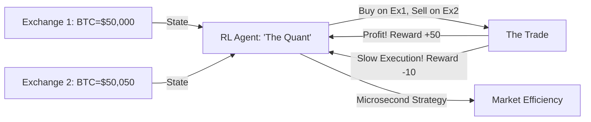

# RL for Automated Trading Arbitrage (High-Frequency AI)

🧠 **What does this do? (The Analogy)**
Think of a **Person who stands in a market and sees that Apples are $1 in Stall A and $1.05 in Stall B**. 
- They instantly buy 100 apples from Stall A and sell them to Stall B. 
- They make $5 in a few seconds (Arbitrage). 
- **RL for Automated Trading Arbitrage** is an AI that does this across **thousands of stocks and crypto exchanges** simultaneously. 
- It looks for "Inefficiencies" in the market. It is rewarded for finding "Risk-free" profits and penalized if it is too slow and the price changes before it can finish the trade. 
It makes the markets more **Efficient** by ensuring prices stay the same across the globe.

🔍 **Step-by-Step Explanation:**
1. **Low-Latency Monitoring**: The AI looks at "Order Books" from 50+ exchanges at once.
2. **Triangular Arbitrage**: Buying Currency A, swapping for B, then C, and back to A to end up with more money than you started with.
3. **Slippage Prediction**: Predicting if the price will drop while you are in the middle of a large trade.
4. **Benefit**: It provides **Liquidity**. By trading against inefficiencies, these AI agents ensure that when you want to buy a stock, there is always a fair price waiting for you.

📊 **High-Level Design (HLD)**

✅ **Why use this?**
It is the gold standard for **High-Frequency Trading (HFT)**. Hedge funds and banks use RL to manage millions of trades per hour. It is a "Zero-Sum" game where the fastest and smartest RL brain wins.

🌍 **Real-World Examples:**
1. **Citadel Securities**: Using massive RL clusters to provide liquidity to the US stock market.
2. **Crypto Arbitrage Bots**: Bots that move money between Binance, Coinbase, and Kraken to profit from price differences.
3. **Forex Trading**: Trading different currency pairs (USD/EUR, EUR/JPY, JPY/USD) to find "Loops" of profit.
