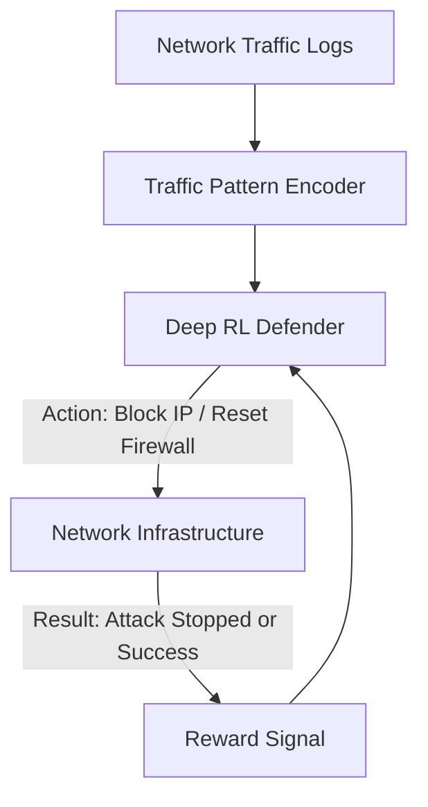

# RL for Cyber Security

🧠 **What does this do? (The Analogy)**
Think of a **Castle Guard**. Every day, thousands of people enter the castle. Some are friendly (Customers), but some are spies (Hackers). If the guard just blocks everyone, the castle goes broke. If they block no one, the spies steal the gold. **Cyber RL** is a "Smart Guard" that watches the behavior of every person. If someone is trying 100 different keys on 100 different doors, the AI instantly recognizes a "Brute Force Attack" and blocks that user before they can find a single open door.

🔍 **Step-by-Step Explanation:**
1. **The State**: Number of connections per IP, packet size, frequency of "Access Denied" errors, and CPU usage spikes.
2. **The Reward**: Minimizing **System Downtime** and **Data Breaches** while maximizing **User Experience**.
3. **The Action**: Update firewall rules, block IP ranges, or redirect traffic to a "Honeypot" (a fake server to trick the hacker).
4. **Adversarial RL**: This is a "War." The Hacker AI tries to find a hole, and the Defender AI tries to close it. They both get smarter over time.

📊 **High-Level Design (HLD)**

✅ **Why use this?**
Hackers move at **Millisecond Speed**. A human security expert cannot react fast enough to a DDoS attack that involves 10 million computers. RL provides the "Automated Shield" that can protect a server in real-time.

🌍 **Real-World Examples:**
1. **DDoS Protection**: Automatically filtering out "malicious" packets while letting "clean" user packets through.
2. **Intrusion Detection**: Finding a "Mole" inside a company network by recognizing strange data-transfer patterns at 3 AM.
