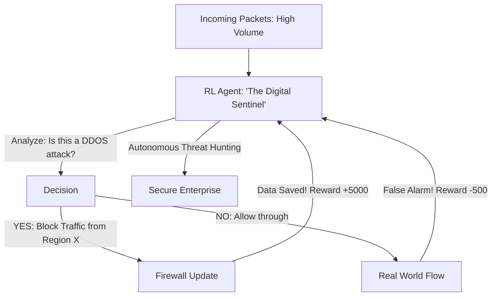

# RL for Cybersecurity Intrusion Response (Digital Shield)

🧠 **What does this do? (The Analogy)**
Think of a **Person guarding a Giant Bank with 1,000 doors**. 
- The robbers (Hackers) are trying every door simultaneously. 
- If the guard locks all the doors, the customers can't get in (System Down). 
- **RL for Cybersecurity** is the AI that manages the **Firewall**. 
- It looks at every packet of data and "Predicts" if it's a robber or a customer. 
- If it sees a pattern that looks like a "Heist," it instantly locks that one specific door (Isolates the network). 
Because hackers move in milliseconds, only an RL agent is fast enough to "Fight back" and protect the data.

🔍 **Step-by-Step Explanation:**
1. **Network Traffic State**: The AI looks at "Packet Logs" and "CPU Usage" across the whole company.
2. **Action Space**: "Block IP," "Force Password Reset," "Shut down Server," or "Allow."
3. **The Reward**: Based on "Total Data Saved" and "System Uptime."
4. **Benefit**: It is **Self-Learning**. When a hacker invents a "New" type of attack, the RL agent notices the "unusual pattern" and learns to block it in minutes, long before a human security team would even wake up.

📊 **High-Level Design (HLD)**

✅ **Why use this?**
It is the best choice for **Zero-Day Protection**. If you want a security system that doesn't just wait for "known viruses" but actively "hunts" for suspicious behavior, RL is the state-of-the-art solution for modern networks.

🌍 **Real-World Examples:**
1. **Darktrace**: A leading cybersecurity company that uses AI to "Self-Heal" corporate networks by responding to attacks in real-time.
2. **Cloudflare**: Using RL to decide which internet traffic to "Challenge" with a CAPTCHA to stop bots without bothering humans.
3. **Cyber-Reason**: An AI platform that "simulates" attacks against itself to learn the best possible defense strategies using RL.
