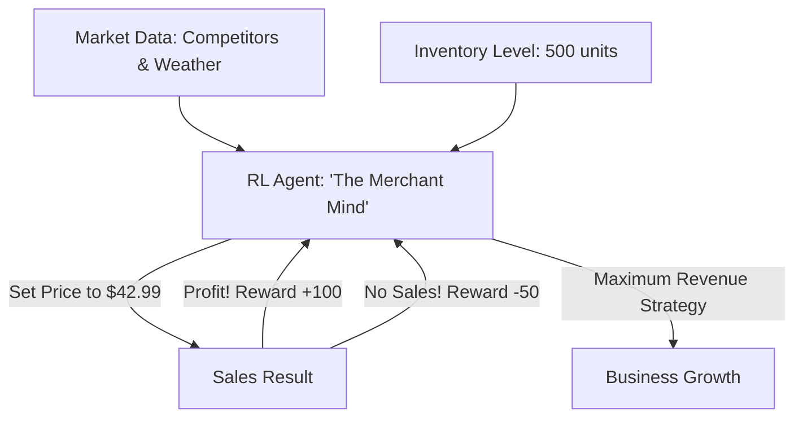

# RL for Dynamic Pricing (Revenue Optimization)

🧠 **What does this do? (The Analogy)**
Think of a **Person selling Ice Cream on a beach**. 
- If they charge $1, everyone buys, but they make no profit. 
- If they charge $50, nobody buys. 
- **RL for Dynamic Pricing** is the AI that manages the **Uber or Amazon Price**. 
- It looks at the time of day, the weather, and how many competitors are nearby, and it constantly "Nudges" the price to the exact point where the most people will buy and the profit is highest. 
It balances **Supply** and **Demand** in real-time.

🔍 **Step-by-Step Explanation:**
1. **Demand Estimation**: The AI learns the "Price Elasticity" (how much people care about price changes).
2. **Competitor Monitoring**: It tracks what others are charging and reacts in milliseconds.
3. **Inventory Management**: If the warehouse is full, the AI lowers the price to move stock. If stock is low, it raises the price to maximize value.
4. **Benefit**: It prevents "Stockouts" and "Overstock." It ensures that resources go to the people who value them most.

📊 **High-Level Design (HLD)**

✅ **Why use this?**
It is the best choice for **Modern Commerce**. Whether you are selling hotel rooms, plane tickets, or groceries, dynamic pricing is the difference between a business that thrives and one that struggles with waste.

🌍 **Real-World Examples:**
1. **Uber/Lyft Surge Pricing**: Matching the number of drivers to the number of riders using RL.
2. **Amazon Marketplace**: Changing prices millions of times a day based on competitor moves.
3. **Airline Ticketing**: Optimizing seat prices based on how many days are left until the flight.
