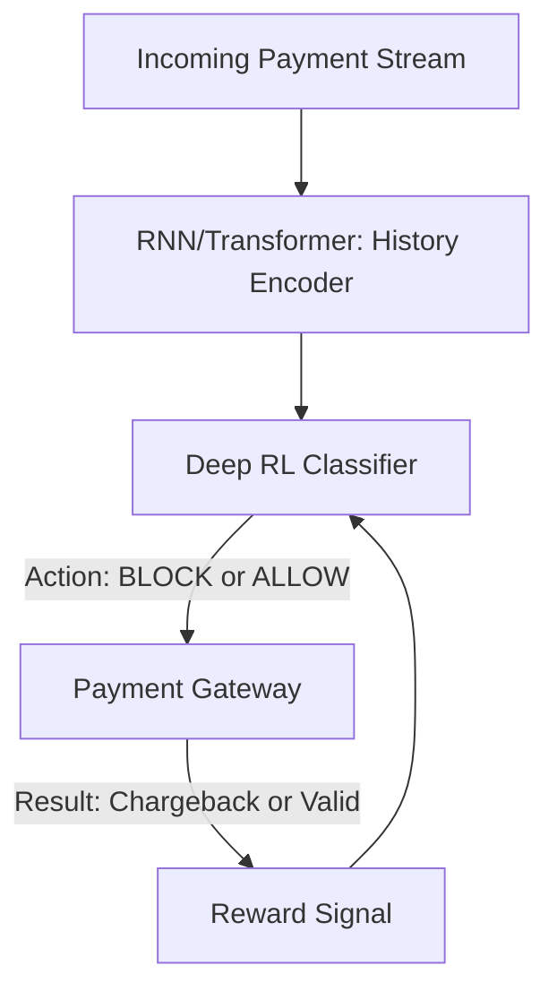

# RL for Fraud Detection

🧠 **What does this do? (The Analogy)**
Think of a **Bank Teller with a Photographic Memory**. They have seen 1,000,000 normal transactions. If someone walks in and tries to do something "Strange" (e.g., spending $5,000 in a country they've never visited), the teller instantly gets a bad feeling. **Fraud RL** is a "Super-Teller" that learns to recognize the subtle "Patterns of a Thief." It learns to spot fraud even when the thief tries to hide by making small, realistic transactions.

🔍 **Step-by-Step Explanation:**
1. **The State**: Transaction history, device fingerprint, geographic location, and spending velocity.
2. **The Reward**: Minimizing **False Positives** (blocking real customers) while maximizing **Fraud Capture** (blocking thieves).
3. **The Action**: Allow, Flag for Review, or Hard Block the transaction.
4. **Sequence Modeling**: Fraud is often a "Story." A thief might buy a $1 coffee to test the card, then a $2,000 laptop 10 minutes later. RL recognizes this sequence perfectly.

📊 **High-Level Design (HLD)**

✅ **Why use this?**
Standard "Rules" (e.g., "Block if > $1000") are easy for thieves to bypass. RL is **Adaptive**. As soon as a thief finds a new way to steal, the RL agent learns that new pattern and blocks it for everyone else in the world.

🌍 **Real-World Examples:**
1. **Visa/Mastercard AI**: Processing 65,000 transactions per second and detecting fraud in under 1 millisecond.
2. **PayPal Protection**: Using RL to decide which transactions need a "Second Factor" (SMS code) based on risk.
3. **Crypto Exchange Security**: Detecting "Wash Trading" or "Pump and Dump" schemes in real-time.
