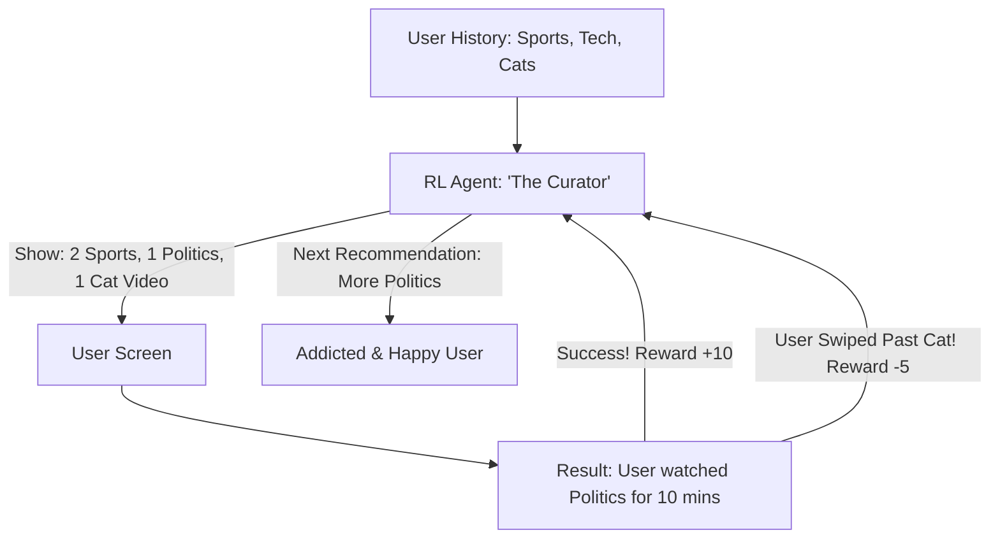

# RL for News Recommendation Feed (Attention AI)

🧠 **What does this do? (The Analogy)**
Think of a **Librarian who gives you a new book every time you finish one**. 
- If they only give you "Gossip Magazines" (Clickbait), you read them fast, but eventually you get bored and leave. 
- If they only give you "Quantum Physics" (Niche), you never start reading. 
- **RL for News Recommendation** is the AI behind **TikTok, YouTube, and Netflix**. 
- It looks at what you clicked, how long you watched (Retention), and whether you shared it. 
- It is rewarded for keeping you **satisfied** over the long term, not just for "tricking" you into clicking once. 
It balances **Personalization** (what you like) with **Exploration** (showing you something new).

🔍 **Step-by-Step Explanation:**
1. **User Embedding**: The AI creates a "Vector" that represents your personality and interests.
2. **Slate Optimization**: Instead of picking 1 video, it picks a "Slate" (a group of 10) that have high variety.
3. **Exploration-Exploitation**: 80% of the feed is what you love, 20% is "Experimental" to see if your tastes have changed.
4. **Benefit**: It prevents the "Filter Bubble." By rewarding **Diversity**, the AI ensures you don't just see the same thing over and over.

📊 **High-Level Design (HLD)**

✅ **Why use this?**
It is the gold standard for **Digital Retention**. If you want to build a platform where people stay for 60 minutes a day, you need RL to learn the complex, changing "Tastes" of every individual human being.

🌍 **Real-World Examples:**
1. **TikTok Algorithm**: The most powerful recommendation RL in the world, capable of learning a user's interests in 5 minutes.
2. **YouTube 'Up Next'**: Using RL to maximize "Long-Term Satisfaction" instead of just clicks.
3. **Spotify Discover Weekly**: Balancing the songs you know with "similar-but-new" artists to keep you discovering music.
