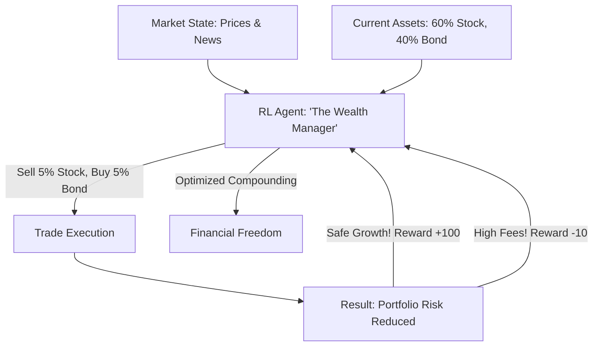

# RL for Stock Portfolio Rebalancing (Wealth AI)

🧠 **What does this do? (The Analogy)**
Think of a **Person managing a Garden with 10 different plants**. 
- Some plants grow fast (Stocks), and some grow slow (Bonds). 
- If you let the fast ones grow too much, they might block the sun and all die in a storm (High Risk). 
- **RL for Stock Portfolio Rebalancing** is the AI that manages **Retirement Funds and Hedge Funds**. 
- It looks at the "Risk" of every stock and decides when to "Prune" (Sell) the winners and "Water" (Buy) the ones that are likely to grow next. 
It ensures that your money grows steadily without ever taking a "gamble" that could lose everything.

🔍 **Step-by-Step Explanation:**
1. **Asset Allocation**: Deciding the % of your money in Tech, Gold, Real Estate, etc.
2. **Sharpe Ratio Optimization**: The AI is rewarded for high "Return-per-unit-of-risk."
3. **Transaction Cost Awareness**: The AI learns that "Trading too much" loses money in fees. It only moves when it is **certain** the trade is worth it.
4. **Benefit**: It is **Emotionless**. Humans often sell when they are scared and buy when they are greedy. RL follows the math, which usually leads to much higher long-term wealth.

📊 **High-Level Design (HLD)**

✅ **Why use this?**
It is the best choice for **Long-Term Investment**. If you want a system that can manage millions of dollars for 30 years, RL-based rebalancing is the most sophisticated way to handle the "Chaos" of the global economy.

🌍 **Real-World Examples:**
1. **BlackRock Aladdin**: The world's largest investment platform, which uses massive AI simulations to manage risk for $10 trillion in assets.
2. **Wealthfront / Betterment**: "Robo-advisors" that use automated logic to keep your taxes low and your portfolio balanced.
3. **Jane Street / Two Sigma**: High-end quant funds that use RL to find the perfect "weight" for every asset in their portfolio.
