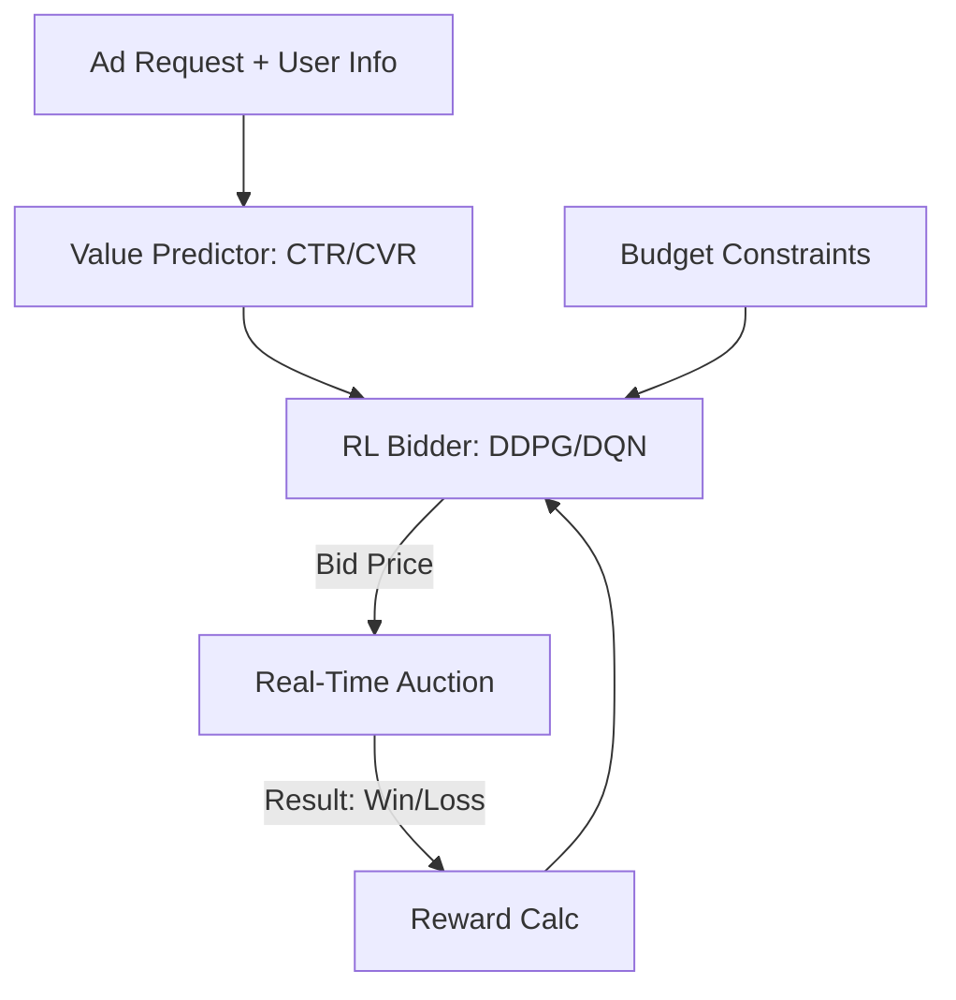

# Real-Time Ad Bidding RL

🧠 **What does this do? (The Analogy)**
Think of an **Auction Hunter**. Every time you open a website, a "Secret Auction" happens in less than 0.1 seconds. Advertisers bid against each other to show you an ad. **Ad Bidding RL** is like a pro bidder who knows exactly how much a "Seat" is worth. It thinks: "This user is very likely to buy a car, so I will bid $5.00." Or: "This user is just browsing, I will only bid $0.05." It tries to win the **Most Valuable Users** while spending the **Least Amount of Money**.

🔍 **Step-by-Step Explanation:**
1. **State ($s_t$)**: Information about the website, the user (anonymized), the time of day, and the **Remaining Budget**.
2. **Action ($a_t$)**: The bid price (e.g., $0.15).
3. **Reward ($r_t$)**: If the ad was clicked or led to a sale, the reward is the **Profit** (Revenue - Bid Cost). If the bid was lost, the reward is 0.
4. **Budget Management**: The AI must learn to "save" its budget for the best opportunities later in the day, rather than spending it all on cheap, low-value users in the morning.
5. **Auction Dynamics**: The AI must also learn the "Winning Price" trends—if it consistently bids too low, it wins nothing; if it bids too high, it loses money.

📊 **High-Level Design (HLD)**

✅ **Why use this?**
Digital advertising is a **$500 Billion industry**. A 1% improvement in bidding efficiency can save a company millions of dollars. Standard rules can't handle the speed and complexity of millions of auctions per second; RL is the only way to optimize this at scale.

🌍 **Real-World Examples:**
1. **Google/Facebook Ad Networks**: Using RL to decide which ads to show to which users in real-time auctions.
2. **Dynamic Pricing for Travel**: Adjusting the bid for travel ads based on real-time flight availability and user search intent.
