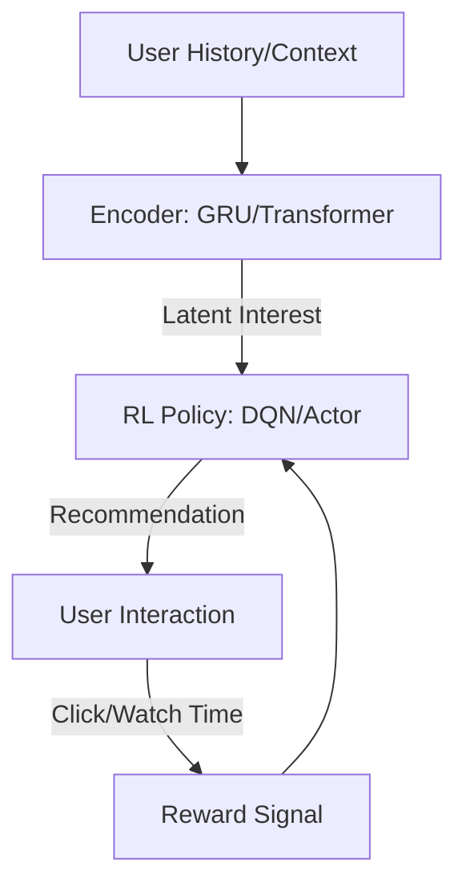

# Sequential Recommendation RL

🧠 **What does this do? (The Analogy)**
Think of a **Personal Shopping Assistant** who learns your taste over time. Most recommendation systems (like Netflix) just look at what you *liked* in the past. **RL Recommendation** looks at your **Journey**. It thinks: "If I show them this Trailer now, will they watch the full Movie later tonight?" It doesn't just want a "Click" right now; it wants to maximize your **Long-term Satisfaction** (Retention).

🔍 **Step-by-Step Explanation:**
1. **State ($s_t$)**: The sequence of items the user has interacted with recently (User History).
2. **Action ($a_t$)**: The specific item or "List of items" to show to the user next.
3. **Reward ($r_t$)**: Did the user click? Did they buy? How long did they stay on the app?
4. **The Goal**: Maximize the **Total Life-Time Value (LTV)** of the user.
5. **Contextual Updates**: As the user clicks, the agent updates its internal "User Embedding" to stay perfectly aligned with their changing mood.

📊 **High-Level Design (HLD)**

✅ **Why use this?**
Standard algorithms are "Greedy"—they show you clickbait to get a fast click. RL is "Strategic"—it shows you high-quality content that keeps you coming back for months. This is why YouTube, TikTok, and Amazon use RL for their feeds.

🌍 **Real-World Examples:**
1. **E-commerce Upselling**: Showing a user a specific accessory after they buy a camera to maximize the total basket value.
2. **Music Streaming**: Curating a 2-hour playlist where every song "prepares" the user for the next one, maximizing the total listening time.
