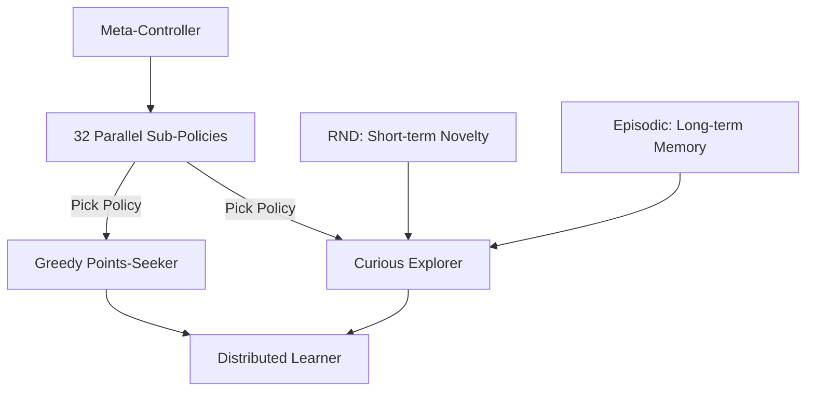

# Agent57 (The Atari Grandmaster)

🧠 **What does this do? (The Analogy)**
Think of a **Professional Video Game Tester**. Some games are easy (Score points fast), and some are hard (You have to explore for hours to find one key). **Agent57** is the first AI that can play **Every Type of Game**. It has a **Personal Assistant** (Meta-Controller) that watches the AI play. If the game is boring, the Assistant says: "Be curious! Go explore!" If the game is dangerous, the Assistant says: "Focus on the points! Play safe!" It is the most "Human-like" gaming AI ever built.

🔍 **Step-by-Step Explanation:**
Agent57 is the "Final Form" of the R2D2 algorithm, adding 3 critical features:
1.  **Never Give Up (NGU)**: An exploration system that rewards the agent for visiting new states, both in the short-term and long-term.
2.  **Meta-Controller**: A "Brain above the Brain" that chooses between 32 different versions of the agent. Some versions are "Curious" and some are "Greedy."
3.  **Distributed Learning**: 256 parallel workers collecting data across all 57 Atari games.
4.  **Universal Architecture**: It uses a single set of hyperparameters to beat every single game, from the easy "Pong" to the near-impossible "Montezuma's Revenge."

📊 **High-Level Design (HLD)**

✅ **Why use this?**
It is the world record holder for Atari RL. It was the first algorithm to achieve "Above Human" performance on all 57 games in the Atari-57 benchmark. It represents the pinnacle of combining memory, exploration, and distributed training.

🌍 **Real-World Examples:**
1. **General Purpose Robots**: A robot that can switch between "Exploring a new house" and "Cleaning the kitchen" perfectly, using the meta-controller to decide when to be curious.
2. **Infinite Game Testing**: Used by companies like Ubisoft or EA to automatically test every corner of a massive open-world game for bugs and balance issues.
