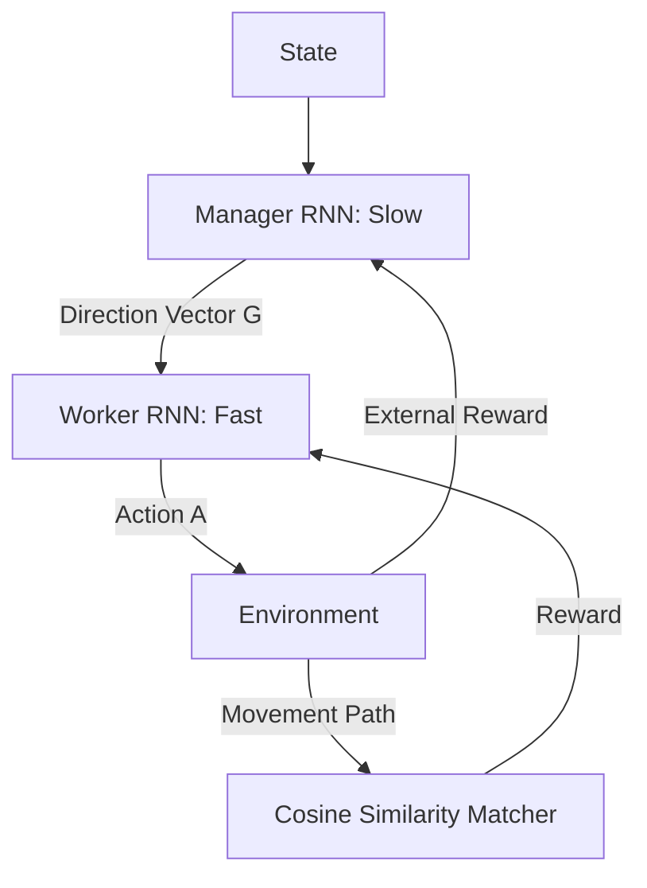

# FeUdal Networks (FuN)

🧠 **What does this do? (The Analogy)**
Think of a **Knight (Manager)** and a **Horse (Worker)**. The Knight doesn't tell the horse "Move your left-back leg." The Knight just points their lance in a **Direction**. The Horse's only job is to move in that direction. If the Horse moves where the Knight points, it gets a treat (Intrinsic Reward). This allows the Knight to think about the "Big Picture" (Strategy) while the Horse handles the "Physics" of movement.

🔍 **Step-by-Step Explanation:**
1. **Manager**: Operates at a slow pace. It outputs a **Goal Vector** in a hidden "Latent Space."
2. **Worker**: Operates at every time step. It tries to make the agent's movement **match** the Manager's vector.
3. **Cosine Similarity**: The Worker is rewarded based on how well its trajectory aligns with the Manager's goal vector.
4. **Decoupling**: The Manager doesn't need to know *how* the worker moves; it only cares that the worker moves in the right *direction*.

📊 **High-Level Design (HLD)**

✅ **Why use this?**
It is one of the most powerful architectures for **Massively Long-Term Memory**. It can solve games where you have to do something at the start and wait 5,000 steps for the result. By decoupling the "What to do" from the "How to do it," it prevents the AI from getting confused.

🌍 **Real-World Examples:**
1. **Satellite Orientation**: A Manager AI decides "Point at the Moon," while the Worker AI manages the dozens of small thruster pulses needed to rotate the massive satellite.
2. **Supply Chain Management**: A Manager decides "Restock the Warehouse," while the Worker handles the hundreds of individual truck routing and scheduling decisions.
