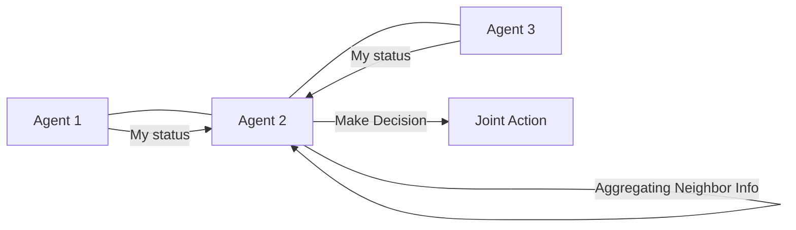

# Graph Neural RL (Relational AI)

🧠 **What does this do? (The Analogy)**
Think of a **Social Network**. 
- To understand if a person is happy, you don't just look at them; you look at their **Friends**. 
- If all their friends are happy, they are likely happy too. 
- **Graph Neural RL** is an AI that doesn't see a "List" of numbers. It sees a **Network of Relationships**. 
- It is used when you have a variable number of objects (e.g., 5 robots today, 50 robots tomorrow) and you want them to coordinate based on who is "next" to whom.

🔍 **Step-by-Step Explanation:**
1. **Nodes and Edges**: Every agent (or object) is a Node. Their relationships (e.g., distance) are Edges.
2. **Message Passing**: Each agent sends a "Summary" of its state to its neighbors.
3. **Aggregation**: Each agent updates its own state by "Listening" to all the messages it received.
4. **Benefit**: It is **Permutation Invariant**. It doesn't matter if you swap "Robot 1" and "Robot 2"—the graph is the same, so the AI's logic stays the same.

📊 **High-Level Design (HLD)**

✅ **Why use this?**
It is the best choice for **Multi-Agent Coordination and Logistics**. If you are managing a power grid, a drone swarm, or a molecule, where the "Connections" between parts are what matters, Graph RL is the only solution.

🌍 **Real-World Examples:**
1. **Traffic Light Control**: Each traffic light is a node. It "listens" to the traffic lights at the next intersection to decide when to turn green.
2. **Chemical Synthesis**: An AI that moves atoms around on a "Graph" (a molecule) to create new medicines.
3. **Drone Swarm Racing**: Drones that coordinate their speed based on the "Network" of drones around them to avoid collisions.
