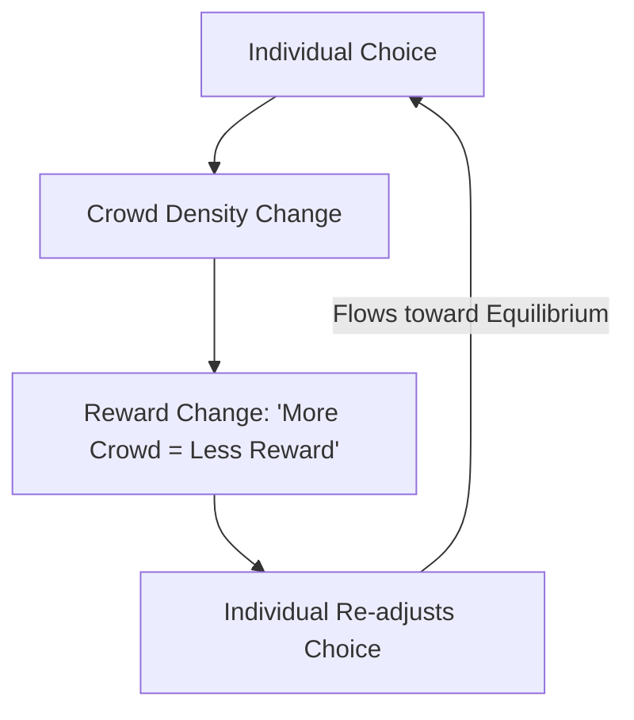

# Mean Field Game Theory (MFG)

🧠 **What does this do? (The Analogy)**
Think of a **Commuter choosing which road to take to work**. 
- If 1,000,000 people take the Highway, it becomes slow (Congestion). 
- If 1,000,000 people take the Backroads, they become slow. 
- **Mean Field Games** is the mathematical study of the "Balancing Point" (Equilibrium) where every person in a million-person crowd has chosen the best possible path for themselves, accounting for the fact that everyone else is also trying to do the same. It treats the crowd as a **Fluid** that flows toward the best rewards.

🔍 **Step-by-Step Explanation:**
1. **The Fokker-Planck Equation**: Describes how the "Density" of the crowd changes over time.
2. **The Hamilton-Jacobi-Bellman Equation**: Describes how an individual should move given the current density.
3. **The Coupling**: These two equations are solved together until the crowd "Settles" into a stable flow.
4. **Benefit**: It is the only way to mathematically prove that a massive system (like a power grid or a stock market) will stay stable.

📊 **High-Level Design (HLD)**

✅ **Why use this?**
It is the backbone of **Macroeconomics** and **Smart City Planning**. If you want to design a subway system or a tax policy that works for 10 million people, you use Mean Field Games to predict how they will all react to the change.

🌍 **Real-World Examples:**
1. **Crowd Evacuation**: Designing stadium exits so that a crowd of 50,000 people flows out as fast as possible without crushing each other.
2. **Electric Vehicle Charging**: Coordinating 100,000 cars so they don't all plug in at 6 PM and crash the city's power grid.
3. **High-Frequency Trading**: Understanding how millions of tiny trades create a "Market Tide" that moves the price of a stock.
