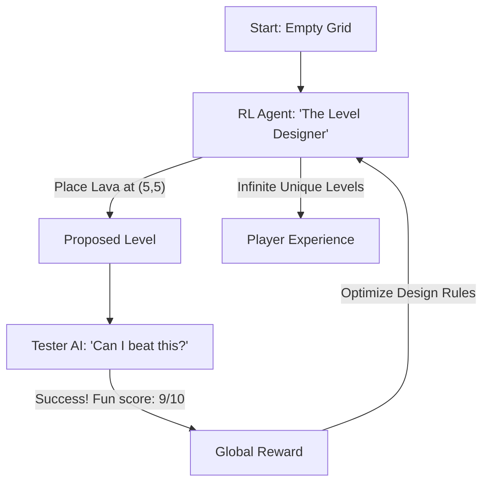

# RL for Game Level Generation (Infinite Content)

🧠 **What does this do? (The Analogy)**
Think of a **Dungeon Master who knows exactly how to challenge you without making you rage-quit**. 
- If the level is too easy, you're bored. If it's impossible, you leave. 
- **RL for Game Level Generation** is an AI that "Plays a Game" where the moves are **Placing Walls, Enemies, and Traps**. 
- It is rewarded for creating a level that a "Tester AI" can finish in exactly 2 minutes with "Medium" difficulty. 
It allows game developers to create **Infinite Worlds** that are always fresh and perfectly balanced for every player.

🔍 **Step-by-Step Explanation:**
1. **The Generator Agent**: A neural network that outputs a grid of tile types.
2. **The Tester Agent**: A second AI that tries to "Solve" the generated level.
3. **The Reward**: Based on "Playability" (Can it be finished?) and "Aesthetics" (Does it look like a real level?).
4. **Benefit**: It is much better than "Random Generation." Random levels often have "broken" paths. RL levels are guaranteed to be functional and fun.

📊 **High-Level Design (HLD)**

✅ **Why use this?**
It is the best choice for **Procedural Games**. Games like *Minecraft* or *No Man's Sky* use math to build worlds, but RL is the next step that makes those worlds feel "hand-crafted" by a human designer.

🌍 **Real-World Examples:**
1. **Super Mario Level Design**: Researchers used RL to generate thousands of "perfect" Mario levels that have never existed before.
2. **Ubisoft (Ghost Recon)**: Using AI to help layout vast forests and mountains so they look natural and are fun to fight in.
3. **Candy Crush**: Using RL to generate new puzzles every day that are challenging but not impossible.
