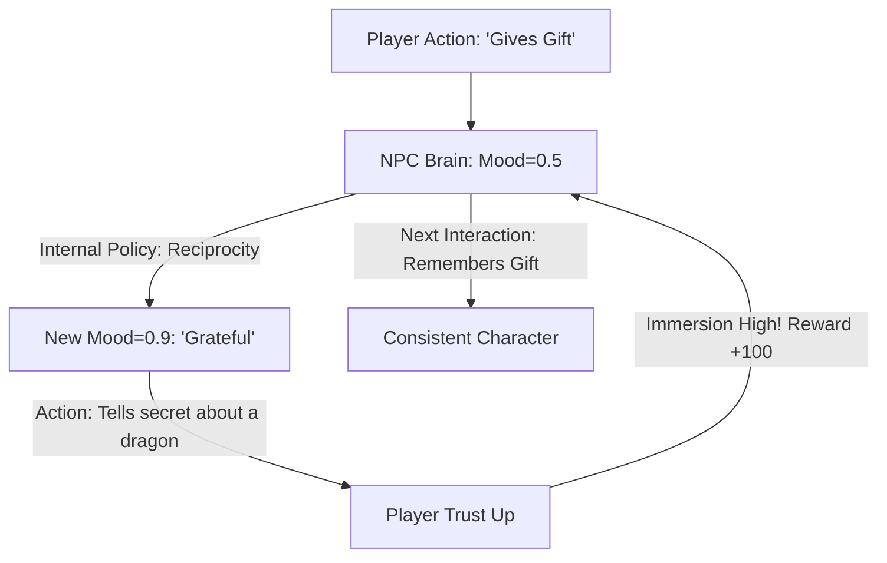

# RL for NPC Emotional Behavior (Virtual Souls)

🧠 **What does this do? (The Analogy)**
Think of an **Actor who never breaks character**. 
- In old games, NPCs (Non-Player Characters) have 3 pre-written lines. 
- **RL for NPC Emotional Behavior** is the AI that gives NPCs a **Personality**. 
- If the NPC is "Vengeful," the AI is rewarded for remembering that the player stole its gold 2 hours ago and reacting with anger. 
- If the NPC is "Kind," it is rewarded for helping the player even when it costs the NPC something. 
It turns "Game Bots" into **"Virtual People"** who have goals, fears, and memories.

🔍 **Step-by-Step Explanation:**
1. **Hidden State (Emotion)**: The NPC has a "Mood" vector (e.g., Happy, Angry, Tired).
2. **Action Space**: Instead of just "Shoot" or "Walk," the actions are "Sarcastic Remark," "Helpful Advice," or "Betrayal."
3. **Consistency Reward**: The AI is penalized if its mood jumps from "Extremely Sad" to "Extremely Happy" in 1 second. It learns to have emotional "inertia."
4. **Benefit**: It creates **Emergent Stories**. Two players might have completely different experiences with the same NPC based on how they treated it.

📊 **High-Level Design (HLD)**

✅ **Why use this?**
It is the best choice for **RPG and Narrative Games**. It allows developers to create "Organic" worlds where the characters feel alive, making the game infinitely more replayable.

🌍 **Real-World Examples:**
1. **Cyberpunk 2077 / Witcher style**: Giving background characters the ability to react dynamically to world events.
2. **AI Dungeon / Latitude**: Using LLMs combined with RL to create characters that never lose track of the story's emotional tone.
3. **Training Simulations**: Creating "Difficult Customers" or "Stressed Patients" for doctors and sales-reps to practice with.
