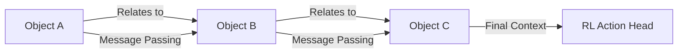

# Relational Graph RL

🧠 **What does this do? (The Analogy)**
Think of a **Party Planner**. Standard RL sees the room as a single "Image" or "Vector." **Relational RL** sees the room as **Objects and People**. It understands that "John" is "Talking to" "Mary," and "The Cake" is "On" "The Table." Instead of learning about the whole room, it learns about **Relationships**. This allows the AI to be much smarter—if you add a new person to the party, the AI already knows how they might "Relate" to others because it understands the *logic* of people.

🔍 **Step-by-Step Explanation:**
1. **Entities (Nodes)**: Every object or person in the environment is a separate node in a graph.
2. **Relationships (Edges)**: Connections between nodes (e.g., distance, parent-child, owner-item).
3. **Message Passing (Graph Neural Networks)**: Nodes share information with their neighbors to understand the global context.
4. **Generalization**: Because the agent learns "How objects interact," you can train it on a game with 2 objects and it will work perfectly on a game with 100 objects.

📊 **High-Level Design (HLD)**

✅ **Why use this?**
It is the only way to solve tasks with **Variable Numbers of Objects**. Standard networks (like CNNs or MLPs) have a fixed input size. Relational RL (using Graph Neural Networks) can handle 5 objects or 5,000 objects without needing to be retrained.

🌍 **Real-World Examples:**
1. **Robotic Swarm Coordination**: Coordinating 100 small robots where each robot is a node and its "Relationship" is the distance to its nearest neighbors.
2. **Chemical Reaction Control**: Managing a complex industrial chemical process where each chemical species is an entity and the agent learns the relationships (reactions) between them.
