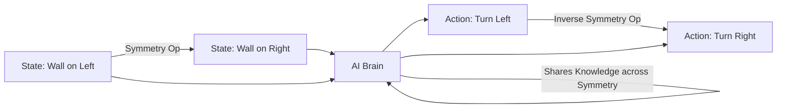

# Symmetry-Aware RL (Invariant Policy)

🧠 **What does this do? (The Analogy)**
Think of a **Person learning to catch a ball**. 
- If they learn to catch with their **Right Hand**, they shouldn't have to start from zero to catch with their **Left Hand**. 
- Their brain already knows the "Physics" of catching. They just need to "Flip" the logic. 
- **Symmetry-Aware RL** is an AI that understands the geometry of the world. 
- If it learns that "Running North" is good, and the room is symmetrical, it automatically knows that "Running South" is also good. This makes it learn **2x or 4x faster** than a normal AI.

🔍 **Step-by-Step Explanation:**
1. **Group Theory**: Defining the mathematical "Group" of symmetries in the environment (e.g., Reflections, Rotations).
2. **Data Augmentation**: Training the AI on the original data AND the "Flipped" version of that data.
3. **Equivariant Networks**: Designing neural networks that are mathematically built to give "Flipped" outputs for "Flipped" inputs.
4. **Benefit**: It prevents the AI from being "confused" by simple changes in perspective.

📊 **High-Level Design (HLD)**

✅ **Why use this?**
It is the best choice for **Physics-Based Tasks**. If you are training a robot to walk, a drone to fly, or a car to drive, the laws of physics are the same whether you are facing North or South. Symmetry-Aware RL captures this truth.

🌍 **Real-World Examples:**
1. **Robotic Leg Control**: Ensuring that a 4-legged robot uses the same efficient gait for its front-left and front-right legs.
2. **Chess AI**: Realizing that the board is (mostly) symmetrical, so a strategy that works on the "Kingside" might also work on the "Queenside."
3. **Medical Imaging**: An AI that recognizes a tumor regardless of whether the X-ray is rotated 90 degrees.
