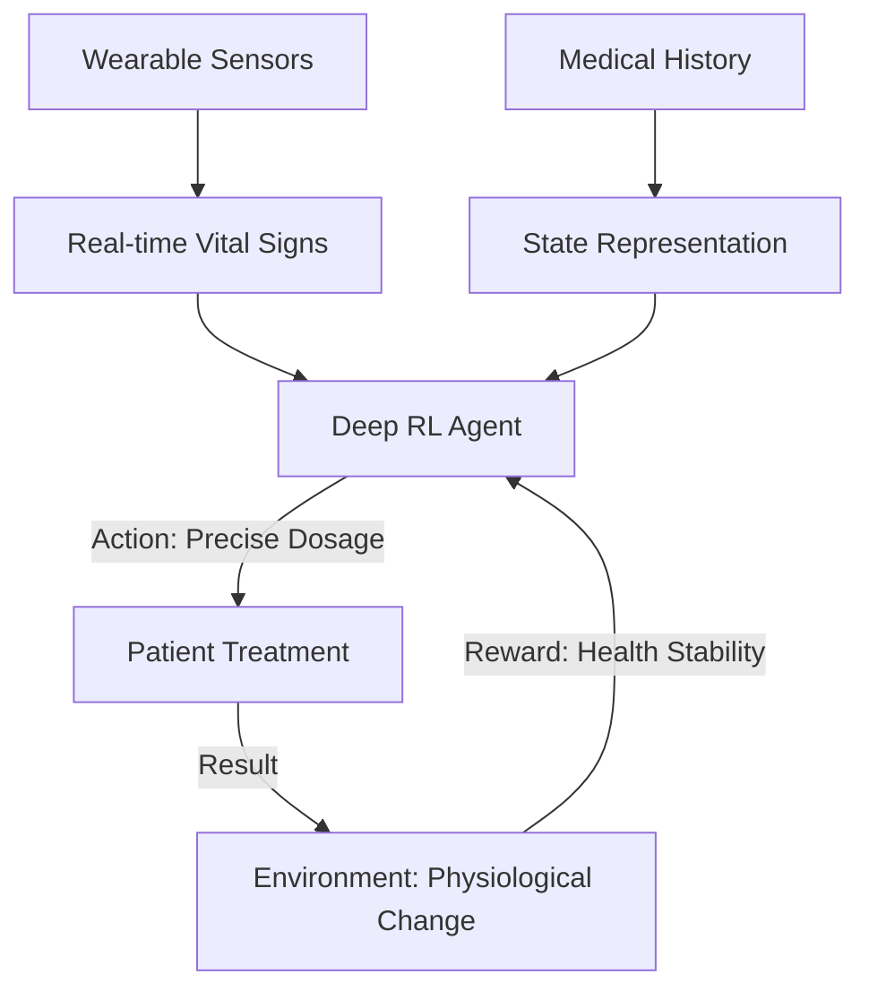

# Healthcare Treatment Optimization RL

🧠 **What does this do? (The Analogy)**
Think of a **Personal Doctor** who stays with a patient 24/7 for 10 years. For chronic diseases (like Diabetes or Cancer), the best treatment changes every day. A human doctor can only see a patient once a month. **Healthcare RL** looks at the patient's data every minute (from smartwatches or monitors) and adjusts the medication dosage perfectly to keep the patient in the "Green Zone" of health.

🔍 **Step-by-Step Explanation:**
1. **The State**: Blood sugar levels, blood pressure, sleep quality, and exercise.
2. **The Reward**: Maximizing **Life Expectancy** and **Quality of Life** (minimizing symptoms).
3. **The Action**: Adjusting the dosage of medication or recommending a specific lifestyle change (e.g., "Take a 10-minute walk now").
4. **Safety RL**: This is a "Safe-RL" task. The AI is restricted by medical rules (Lyapunov stability) so it can never recommend a dangerous dose.

📊 **High-Level Design (HLD)**

✅ **Why use this?**
It is the future of **Personalized Medicine**. Every human body is different. RL allows us to find the "Perfect Dosage" for *your* body, rather than using a "one-size-fits-all" pill.

🌍 **Real-World Examples:**
1. **Artificial Pancreas**: Using RL to automatically pump the exact amount of insulin into a diabetic patient based on their real-time blood sugar.
2. **Sepsis Treatment in ICU**: Helping ICU doctors decide the perfect balance of fluids and vasopressors to save patients from organ failure.
