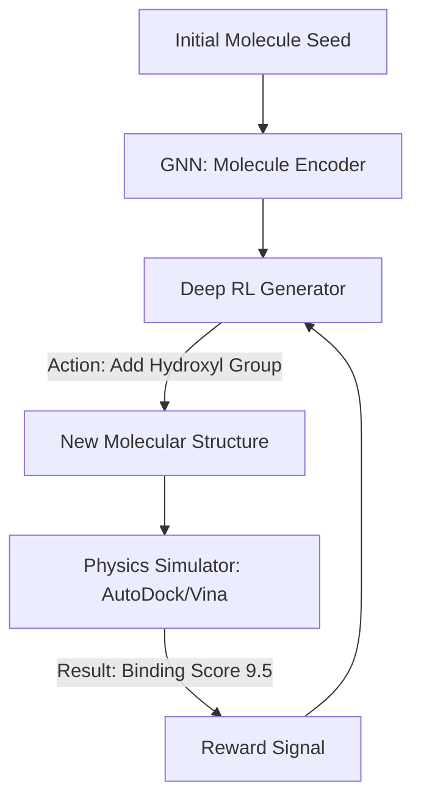

# RL for Drug Discovery

🧠 **What does this do? (The Analogy)**
Think of a **Master Chemist with a LEGO set**. They have a billion pieces, but they only want to build a structure that "Locks" into a specific disease cell (like a key into a lock). **Drug Discovery RL** is an AI that plays a game: "Build the molecule that fits the lock." It tries adding an atom here, a bond there, and then simulates: "Does this cure the disease?" If the answer is "Almost," it keeps going until it finds a **New Medicine** that no human has ever thought of before.

🔍 **Step-by-Step Explanation:**
1. **The State**: The current graph structure of the molecule (Atoms and Bonds).
2. **The Reward**: A combination of **Binding Affinity** (how well it sticks to the disease), **Solubility** (will it dissolve in the body?), and **Toxicity** (is it safe?).
3. **The Action**: Add an atom, remove a bond, or change a molecular group.
4. **Graph RL**: Since molecules are "Graphs" (nodes and edges), the RL agent uses a **GNN (Graph Neural Network)** to understand the "Physics" of the molecule.

📊 **High-Level Design (HLD)**

✅ **Why use this?**
It takes **10 years and $2 billion** to find one new drug. RL can simulate billions of molecules in a single month, finding "Lead Candidates" that have a high chance of working in the real world, potentially saving millions of lives and reducing costs.

🌍 **Real-World Examples:**
1. **DeepMind AlphaFold**: While primarily for protein folding, the same RL principles are used to design "Small Molecules" that interact with those proteins.
2. **Insilico Medicine**: The first company to have an AI-discovered drug enter human clinical trials (for pulmonary fibrosis).
