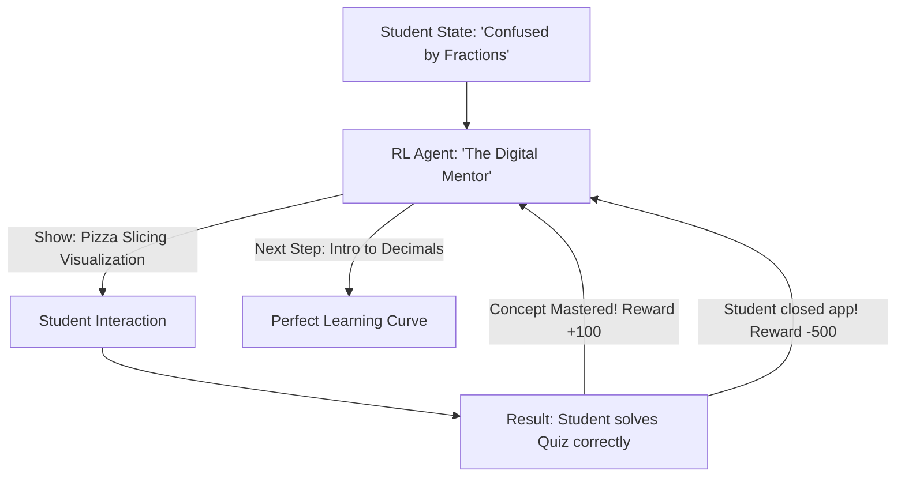

# RL for Personalized Tutor Path (Adaptive Education)

🧠 **What does this do? (The Analogy)**
Think of a **Personal Tutor who has a superpower: They can see inside your brain**. 
- If you're confused by "Multiplication," they don't move on to "Division" just because the textbook says so. 
- They might go back to "Addition" or show you a "Visual Game" instead. 
- **RL for Personalized Tutor Path** is the AI that manages **Duolingo, Khan Academy, and Coursera**. 
- It treats your education as a game. It is rewarded when you **pass a test** in the shortest amount of time without giving up (Frustration). 
It creates a **Custom Roadmap** for every single student on Earth.

🔍 **Step-by-Step Explanation:**
1. **Knowledge Tracing**: The AI maintains a "Model" of what you know and what you've forgotten.
2. **Instructional Action**: The AI chooses between "Video," "Quiz," "Review," or "New Concept."
3. **The Reward**: Based on the "Knowledge Gain" (Score after Lesson - Score before Lesson).
4. **Benefit**: It prevents the "One-Size-Fits-All" problem. It ensures that students who are fast aren't bored, and students who are slow aren't left behind.

📊 **High-Level Design (HLD)**

✅ **Why use this?**
It is the best choice for **EdTech Platforms**. If you want to increase student graduation rates or help people learn a new language in 3 months instead of 3 years, RL-based path optimization is the most powerful tool available.

🌍 **Real-World Examples:**
1. **Duolingo**: Using RL to decide exactly when to show you a "Hard" word to maximize your long-term memory.
2. **Khan Academy**: Experimenting with "Adaptive Paths" that change based on a student's mistakes in real-time.
3. **Corporate Training**: Helping employees learn new software by showing them the exact features they are struggling with.
