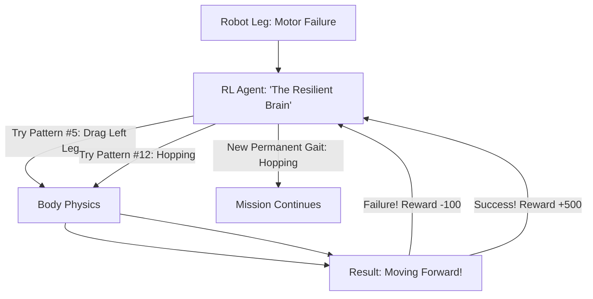

# RL for Robot Gait Recovery (Self-Healing AI)

🧠 **What does this do? (The Analogy)**
Think of a **Person who trips and sprains their ankle**. 
- They don't just "stop walking." They instantly figure out a **Limp** (A new gait) that lets them move without putting weight on the hurt foot. 
- **RL for Robot Gait Recovery** is the AI that manages **Robotic Dogs and Humanoids**. 
- If one of the robot's motors breaks or a leg gets stuck in the mud, the AI doesn't crash. 
- It "Plays a 5-second Game" in its head to find a new way to move its remaining legs to stay balanced and keep moving. 
It makes robots **Indestructible** and **Resilient** to the messiness of the real world.

🔍 **Step-by-Step Explanation:**
1. **The 'Limp' Search**: The AI uses **Meta-RL** to quickly try out 100 different leg patterns.
2. **Proprioceptive Feedback**: It feels the "Balance" of its body (Gyroscope data).
3. **The Reward**: Based on "Forward Progress" while staying upright.
4. **Benefit**: It is much better than human-designed "Backup gaits." The AI can find a way to walk even if 2 out of 4 legs are missing.

📊 **High-Level Design (HLD)**

✅ **Why use this?**
It is the best choice for **Search and Rescue Robotics**. If you send a robot into a collapsed building, you can't go in and fix it if a brick falls on its leg. RL ensures the robot can "self-heal" its movement and finish the mission.

🌍 **Real-World Examples:**
1. **Boston Dynamics 'Spot'**: Using RL to recover from slips on ice or kicks from humans.
2. **NASA Mars Rovers**: Developing "Gait Recovery" so that if a wheel gets stuck in Martian sand, the rover can "wiggle" its way out.
3. **Prosthetic Limbs**: AI-powered legs that adjust their "Gait" in real-time to help a human walk on sand, stairs, or grass.
