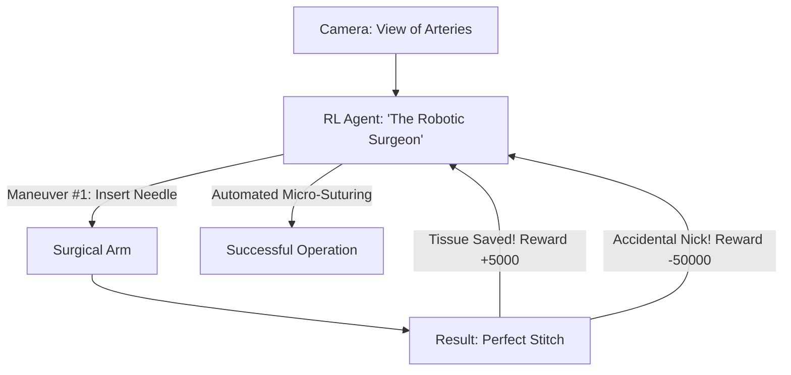

# RL for Robot Hand Surgery (Precision Medicine)

🧠 **What does this do? (The Analogy)**
Think of a **Person trying to thread a needle while their hands are shaking**. 
- The needle is a **Surgical Tool**. 
- The thread is **Human Tissue**. 
- **RL for Robot Hand Surgery** is the AI that manages the **da Vinci Surgical System**. 
- It "Cancels out" the human surgeon's tremors and can even perform "Sub-Tasks" (like sewing a wound) **completely by itself**. 
- It is rewarded for **Sub-Millimeter Precision** and penalized if it touches anything it shouldn't (Tissue Trauma). 
It allows for surgeries that are so precise that a human could never perform them by hand.

🔍 **Step-by-Step Explanation:**
1. **Visual Servoing**: The AI uses a high-speed camera to track the "tip" of the needle and the edge of the wound.
2. **Haptic Feedback**: It "Feels" the resistance of the tissue using force sensors.
3. **Safe Policy Optimization**: A hard constraint system ensures the robot never moves outside the "Surgical Zone."
4. **Benefit**: It reduces **Recovery Time**. Because the AI is more precise than a human, the wounds are smaller, there is less blood, and the patient heals days faster.

📊 **High-Level Design (HLD)**

✅ **Why use this?**
It is the gold standard for **Next-Gen Medical Tech**. We are moving toward "Semi-Autonomous Surgery," where a human doctor manages the high-level plan and the RL agent handles the "Hand-Eye Coordination" of the actual procedure.

🌍 **Real-World Examples:**
1. **da Vinci Surgical System**: Using AI to assist surgeons in over 1 million operations every year.
2. **Smart Tissue Autonomous Robot (STAR)**: An RL-based robot that successfully performed soft-tissue surgery on a pig without any human help.
3. **Microsure**: A robot designed specifically for "Micro-Surgery" (like reattaching tiny blood vessels) using RL for stability.
