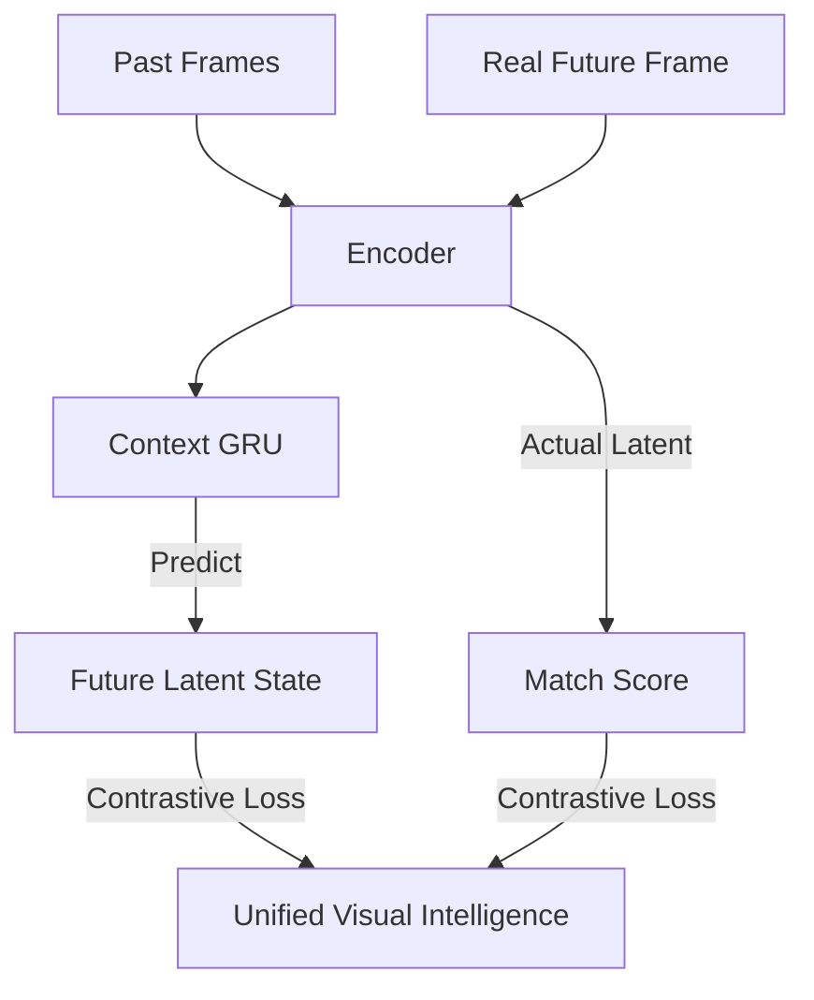

# Contrastive Predictive Coding (CPC)

🧠 **What does this do? (The Analogy)**
Think of a **Person reading a Mystery Book**. After every chapter, the reader tries to guess what will happen in the **next** chapter. They don't need to guess the exact words; they just need to guess the "vibe" (e.g., "The detective will find a clue"). **CPC** is an AI that tries to predict its own **Future Representation**. By trying to guess what its "future thoughts" will be, the AI learns a deep understanding of the environment's patterns without needing any reward points.

🔍 **Step-by-Step Explanation:**
1. **Encoder ($g_{enc}$)**: Turns raw input (sound/video) into a latent code $z$.
2. **Context ($g_{ar}$)**: A recurrent network that summarizes all past codes into a context $c$.
3. **Prediction**: The AI uses the current context $c$ to predict the latent code $z$ of 5-10 steps into the future.
4. **Contrastive Loss (InfoNCE)**: 
   - The AI is shown the **Real** future code and 10 **Fake** future codes (from other videos).
   - It must correctly identify the "Real" one.
   - This forces the AI to learn features that are "Predictive" and "Consistent" over time.

📊 **High-Level Design (HLD)**

✅ **Why use this?**
It is the gold standard for **Self-Supervised Audio and Video**. If you want an AI to understand human speech or complex video patterns, you use CPC. It allows the AI to learn "High-level" concepts (like phonemes in speech or physics in video) entirely on its own.

🌍 **Real-World Examples:**
1. **Speech Recognition**: Pre-training an AI to understand human speech patterns by predicting the next part of a sentence, making it much better at transcriptions.
2. **Video Surveillance**: Learning to recognize "Abnormal Behavior" by first learning what "Normal Behavior" looks like through future prediction.
