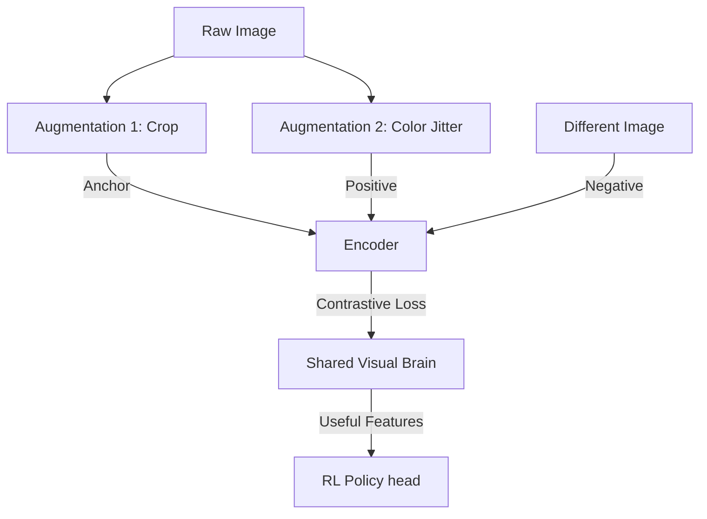

# CURL (Contrastive Unsupervised RL)

🧠 **What does this do? (The Analogy)**
Think of a **Person learning to identify fruit**. Standard RL is like someone telling you "That is an Apple" only when you get a reward. **CURL** is like looking at an Apple from two different angles. Even if no one tells you it's an Apple, you learn that **these two images are of the same object**. By learning to recognize that "this view" and "that view" belong to the same thing, you build a massive understanding of the world before you even start the game.

🔍 **Step-by-Step Explanation:**
1. **Data Augmentation**: Take one frame (Anchor) and create a slightly different version of it (Positive) by cropping or jittering.
2. **Contrastive Learning**: Train a network to produce the **same code** (embedding) for the Anchor and the Positive.
3. **Negative Sampling**: Take a completely different frame (Negative) and ensure its code is **very different**.
4. **The Benefit**: The AI learns a "Visual Language" extremely fast. It can learn to play a game from raw video 2-5x faster than standard PPO or SAC.

📊 **High-Level Design (HLD)**

✅ **Why use this?**
It is the current **State-of-the-Art** for learning from pixels. If you want a robot to learn from a camera, you use CURL so it doesn't waste weeks trying to figure out what a "table" or a "hand" is.

🌍 **Real-World Examples:**
1. **Security Vision**: A camera system that learns to track a person across different cameras by recognizing they are "the same entity" even from different angles.
2. **Industrial Sorting**: A robot arm that learns to identify "Gears" and "Bolts" in a messy bin by comparing different views of the same parts.
