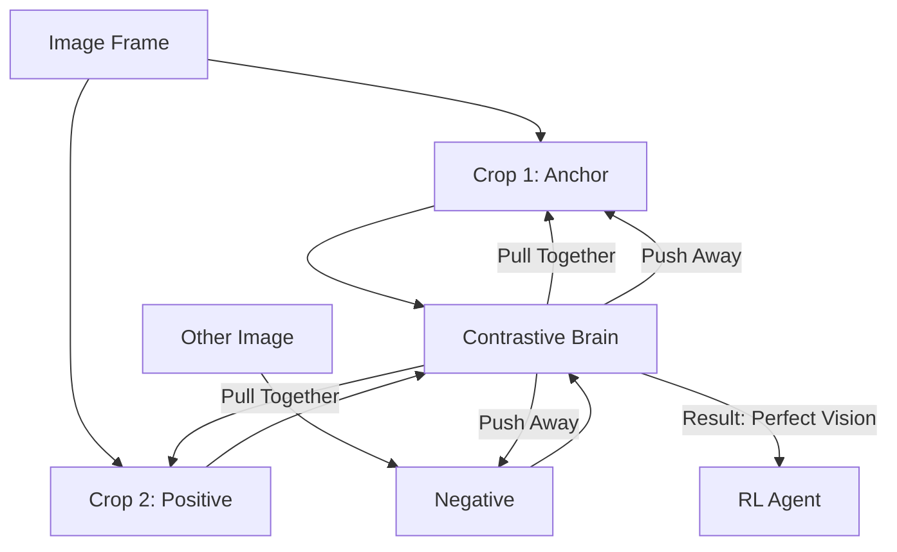

# CURL (Contrastive Unsupervised RL)

🧠 **What does this do? (The Analogy)**
Think of a **Spot the Difference** game. 
- You have two photos of a room. One is zoomed in slightly, one is rotated slightly. 
- A human knows they are the **Same Room**. 
- A standard AI thinks they are completely different because the pixels changed. 
**CURL** is an AI that learns to recognize "The Essence" of a scene. It learns that even if the camera moves, the **Meaning** of the image (e.g., "There is a door here") stays the same. This allows the AI to learn from pixels as fast as if it were learning from a simple list of numbers.

🔍 **Step-by-Step Explanation:**
1. **Data Augmentation**: Take one image and create two random "Crops" of it.
2. **Anchor/Positive**: These two crops are a "Positive Pair" (they came from the same source).
3. **Contrastive Loss**: The AI is trained to move the "Mathematical Code" of positive pairs together, while pushing "Negative Pairs" (different images) far apart.
4. **Benefit**: The AI learns a very powerful "Visual Brain" without needing any game rewards. It just learns to "See" the world correctly.

📊 **High-Level Design (HLD)**

✅ **Why use this?**
It is the current **Record Holder** for visual sample efficiency. It allows an AI to learn to control a robot from a raw camera feed in just **100,000 steps**, whereas previous methods took 10,000,000 steps.

🌍 **Real-World Examples:**
1. **Robotic Picking from Camera**: A robot arm learning to recognize a "Cup" even if the lighting changes or the camera shakes.
2. **Autonomous Drones**: Recognizing "Obstacles" like trees and wires in many different weather conditions by learning the "Essence of a Tree."
