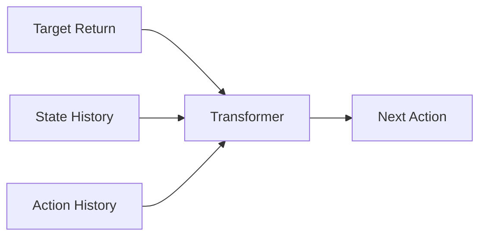

# Decision Transformer (DT)

🧠 **What does this do? (The Analogy)**
Think of a **GPS for Success**. Standard RL is like a car that tries every turn to see where it ends up. A Decision Transformer is like a GPS where you **input the destination** (Target Reward), and it tells you exactly what turns to take to get there. It treats RL as a "Sequence Prediction" task, exactly like GPT treats language.

🔍 **Step-by-Step Explanation:**
1. **RL as Sequence Modeling**: Instead of learning a value function, we treat states, actions, and rewards as a "sentence."
2. **Returns-to-Go (RTG)**: This is the most important input. We tell the model: "I want to get a total reward of 100."
3. **Action Prediction**: The Transformer looks at the history and the desired RTG and predicts the action that will fulfill that goal.
4. **Trajectory Stitching**: It can combine the best parts of different paths it has seen in the past to create a "perfect" new path.

📊 **High-Level Design (HLD)**

✅ **Why use this?**
It is the "Modern" way of doing RL. Because it uses the Transformer architecture, it can scale to massive amounts of data and learn very long-term dependencies that standard algorithms (DQN/PPO) might miss.

🌍 **Real-World Examples:**
1. **Robotic Manipulation**: Learning to assemble a complex machine by watching thousands of hours of video and "requesting" a successful assembly.
2. **Game Playing (Minecraft)**: Requesting the AI to "Find Diamond" and letting the Transformer predict the thousands of steps needed based on previous data.
