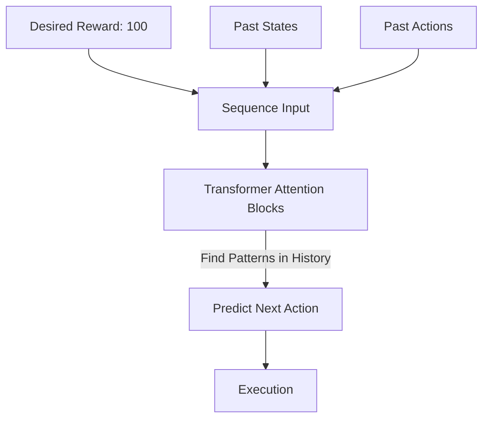

# Decision Transformer (RL as Sequence Modeling)

🧠 **What does this do? (The Big Picture)**
Standard RL is like a student who learns by **Trial and Error**. They try things, get a score, and adjust. **Decision Transformer** is like a student who reads a **History Book**. They look at thousands of past games and learn the pattern: "When the score was low and the player took Action X, the score became high." It treats Reinforcement Learning like a **Translation Task**. It "translates" a desired future reward and a past history into the next perfect action.

🔍 **The Transformer Paradigm Shift:**

1.  **No TD-Learning**: It doesn't use Bellman equations or Q-values. It uses the **Attention Mechanism** (the same technology as ChatGPT).
2.  **Returns-to-Go ($R_t$)**: You tell the AI: "I want a total reward of 100." The AI then looks at the current state and says: "To get 100 from here, based on history, the next move should be Y."
3.  **Causality**: It uses a "Causal Mask" to ensure it only looks at the past to predict the future, never the other way around.
4.  **Offline Power**: It is incredibly good at learning from existing datasets without ever having to play the game itself.

📊 **High-Level Design (HLD)**

✅ **Why use this?**
It is the **future of Offline RL**. If you have a massive dataset of human behavior (e.g., millions of hours of driving data or medical records), you use Decision Transformer to "Model" that behavior. It is much more stable than standard Q-learning on static datasets and doesn't suffer from "delusional" optimism.

🌍 **Real-World Examples:**
1. **Robotic Path Planning**: Learning to navigate a warehouse by watching thousands of hours of manual forklift operation.
2. **Personalized Medicine**: Predicting the best sequence of treatments for a patient by "attending" to their medical history and the desired health outcome.
3. **LLM Control**: Using the Transformer's natural ability to handle sequences to control robots using the same logic used for text.
