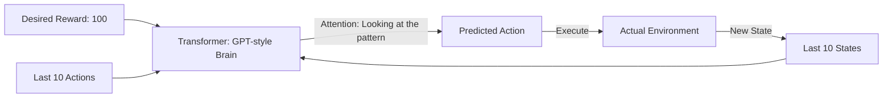

# Decision Transformer (RL as Sequence Modeling)

🧠 **What does this do? (The Analogy)**
Think of a **Scriptwriter finishing a movie**. 
- They have the first 3 scenes of the movie (State/Action history). 
- They know how they want the movie to end: "The Hero wins the prize" (Returns-to-go). 
- To write the next scene, the writer just asks: "Based on the first 3 scenes and the fact that the hero **must** win at the end, what is the most logical next move?" 
**Decision Transformer** treats RL like a **Language Translation** problem. Instead of translating English to French, it translates "History + Goal" into "Next Action." It uses the same technology as **ChatGPT** to solve reinforcement learning.

🔍 **Step-by-Step Explanation:**
1. **Sequence Modeling**: The state, action, and reward are treated as "Words" in a sentence.
2. **Returns-to-Go**: Instead of predicting how much reward we *will* get, we tell the AI how much reward we *want* (e.g., "Give me a trajectory that gets 500 points").
3. **Transformer Architecture**: Uses self-attention to look back at the entire history of the episode to find the best next move.
4. **Benefit**: It is **Stable and Scalable**. Because it is just "Next-token prediction," it doesn't suffer from the "instability" of standard RL (like Q-learning or Policy Gradients).

📊 **High-Level Design (HLD)**

✅ **Why use this?**
It is the best choice for **Large-Scale Multi-Task Learning**. If you want a "Foundation Model" for robotics that has seen 1,000,000 different videos of robots, Decision Transformer is the architecture that allows it to learn from all of them at once.

🌍 **Real-World Examples:**
1. **Multi-Game AI**: A single Transformer that can play 50 different games just by being "conditioned" on the name of the game and a high score.
2. **Robot Manipulation**: A robot arm that can "see" a video of a human and "translate" that video into its own motor commands.
3. **Logistics**: Predicting the next 5 steps for a fleet of trucks by looking at the last 24 hours of traffic and a "Fuel Efficiency" goal.
