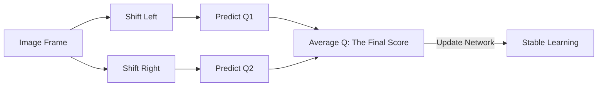

# DrQ (Data Regularized Q-Learning)

🧠 **What does this do? (The Analogy)**
Think of an **Art Critic looking at a painting**. 
- A standard critic looks at the painting once and gives it a score. 
- A **DrQ** critic looks at the painting, then moves 1 inch to the left, then puts on sunglasses, then moves 1 inch to the right. 
- They give the painting a score only after seeing it from **multiple slightly different angles**. 
This ensures the score is based on the **Content** of the painting, not just a random reflection of light or a specific camera angle.

🔍 **Step-by-Step Explanation:**
1. **Random Shifting**: Take the input image and shift it by 1-4 pixels in any direction.
2. **Multiple Augmentations**: Perform this shift 2 or 3 times for the **same** experience.
3. **Q-Target Averaging**: Calculate the target Q-value as the average of all these shifted versions.
4. **Benefit**: This acts as a "Smoothing" filter. It prevents the neural network from "overfitting" to a specific pixel configuration, making it 10x more stable for robot control.

📊 **High-Level Design (HLD)**

✅ **Why use this?**
It is the current **Top Performer for Robot Manipulation**. It allows a robot to learn to "Stack Blocks" or "Move Pegs" from a camera feed with incredible reliability.

🌍 **Real-World Examples:**
1. **Google Robotics (TossingBot)**: Using DrQ-style regularization to help a robot learn to throw objects into bins by being robust to different lighting and item positions.
2. **Quality Control AI**: An AI that recognizes "Scratches" on a product even if the product is slightly tilted on the conveyor belt.
