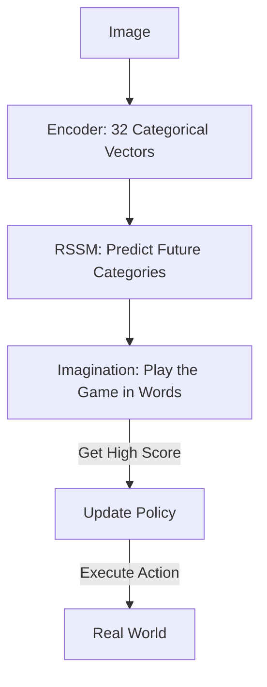

# DreamerV2 (Discrete Latent RSSM)

🧠 **What does this do? (The Analogy)**
Think of a **Storyteller**. 
- DreamerV1 is like a storyteller who uses **Blurry Images** to describe the world. If you could either go to the Beach or the Mountains, DreamerV1 "averages" them and imagines you are in a "Wet Mountain" (which doesn't exist). 
- **DreamerV2** is like a storyteller who uses **Words (Categories)**. It says: "You are either at the [BEACH] or the [MOUNTAINS]." 
By using **Discrete (Categorical)** variables in its brain, it can imagine clear, distinct futures without them getting "fuzzy" or "average."

🔍 **Step-by-Step Explanation:**
1. **Discrete Bottleneck**: The neural network maps an image into a set of "One-Hot" vectors (like 32 categories).
2. **RSSM (Recurrent State Space Model)**: It predicts how these categories change over time as the agent moves.
3. **Dreaming**: It simulates millions of games entirely inside its "Categorical Brain," never looking at a real image during training.
4. **Benefit**: It is the first algorithm to achieve **Human-level performance on Atari** using only a World Model. It is incredibly robust to complex, unpredictable environments.

📊 **High-Level Design (HLD)**

✅ **Why use this?**
It is the standard for **Vision-Based Model-Based RL**. If you want an AI to learn to play a video game or drive a car just by "watching" the pixels, DreamerV2 is the most powerful "Brain" you can give it.

🌍 **Real-World Examples:**
1. **DeepMind Atari Benchmark**: DreamerV2 beat the previous records on almost all 57 Atari games.
2. **Autonomous Warehouse Navigation**: An AI that "dreams" about different ways the boxes could be moved to find the most efficient path.
